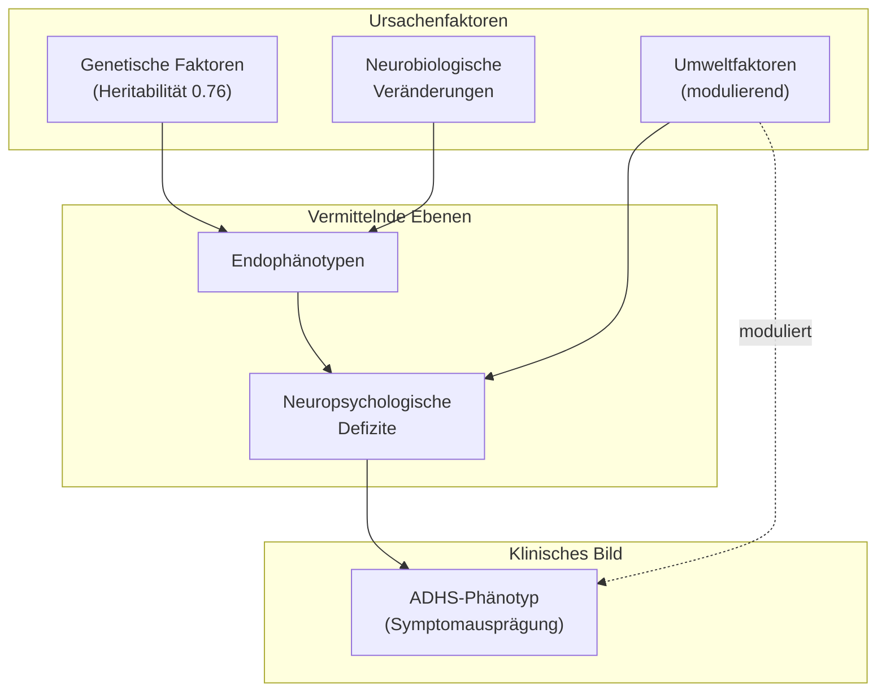
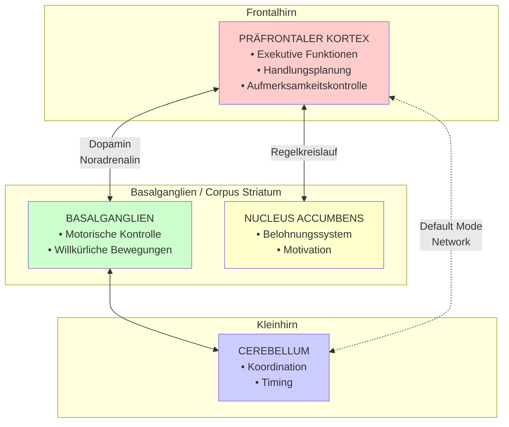
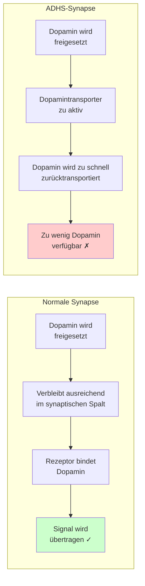
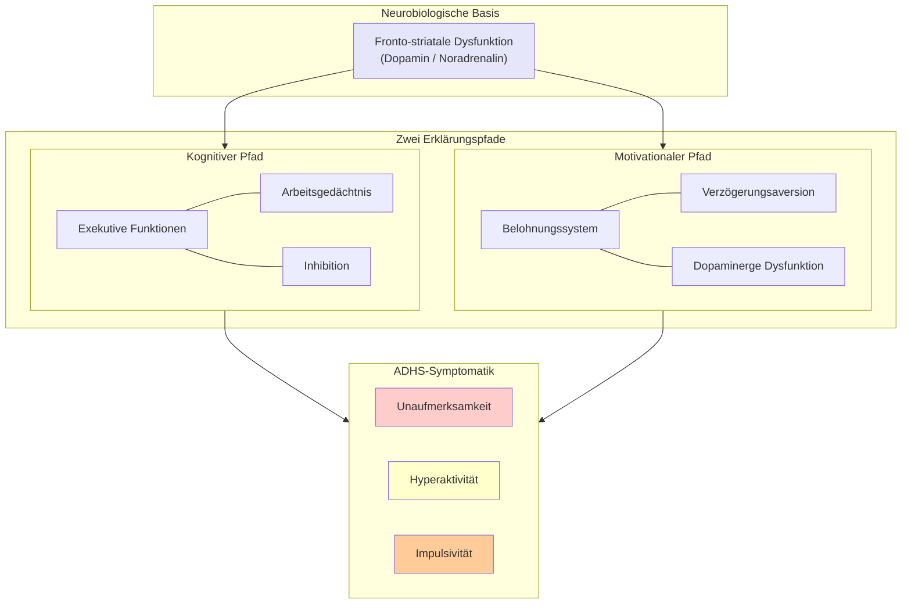
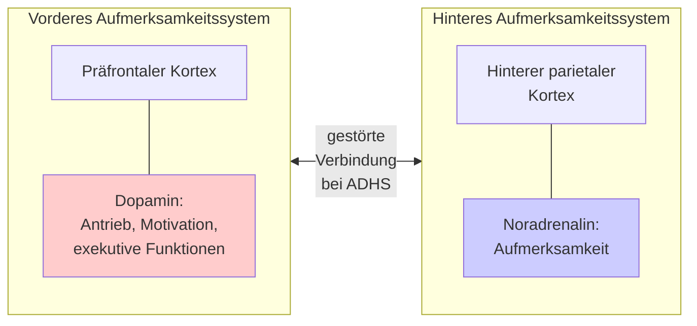

# 1. Was ist ADHS

## 1.1 Definition nach Diagnosemanualen

### Grundlegende Charakterisierung

ADHS (Aufmerksamkeitsdefizit-/Hyperaktivitätsstörung) ist eine psychische Störung, die sich durch drei **Kernsymptome** (Kardinalsymptome) auszeichnet:

|Kernsymptom|Beschreibung|
|---|---|
|**Aufmerksamkeitsschwäche**|Kurze Daueraufmerksamkeitsspanne, hohe Ablenkbarkeit durch äußere Reize, geringe Ausdauer, oberflächliche/unvollständige Anfertigung von Arbeiten, Tagträumen, Vergesslichkeit|
|**Hyperaktivität**|Erhöhte Unruhe und Zappeligkeit, übermäßiger Bewegungsdrang, Unfähigkeit längere Zeit still zu sitzen, Rastlosigkeit, hohes Mitteilungsbedürfnis|
|**Impulsivität**|Spontanes, unreflektiertes Handeln, Ungeduld, häufiges Unterbrechen von Gesprächen, Vordrängen, Neigung zur Waghalsigkeit, Schwierigkeiten planvoll zu handeln|

> **Quelle:** Frölich-Döpfner_ADHS_in_Schulen_und_Unterricht.pdf; Dägling_Gehirn_und_ADHS.md

---

### Die zwei internationalen Klassifikationssysteme

Es existieren zwei anerkannte psychiatrische Klassifikationssysteme:

**ICD (International Classification of Diseases)**

- Herausgegeben von der WHO (World Health Organization)
- Aktuell: ICD-10 (ICD-11 bereits in englischer Fassung publiziert)
- In Deutschland kassenärztlich verbindlich
- Bezeichnet die Störung als **"Hyperkinetische Störung" (HKS)**
- Strengere Kriterien → niedrigere Prävalenzraten (ca. 1–2%)

**DSM (Diagnostic and Statistical Manual of Mental Disorders)**

- Herausgegeben von der APA (American Psychiatric Association)
- Aktuell: DSM-5
- Bezeichnet die Störung als **"ADHS"**
- Weniger strenge Kriterien → höhere Prävalenzraten (ca. 5,3%)

> **Quelle:** Frölich-Döpfner_ADHS_in_Schulen_und_Unterricht.pdf; Reh_Berdelmann_Dinkelaker_Aufmersamkeit_Geschichte-Theorie-Empirie.pdf

---

### Diagnostische Kriterien nach ICD-10

**Symptomkriterien für Unaufmerksamkeit** (mindestens 6 von 9 Symptomen über mindestens 6 Monate):

1. Häufig unaufmerksam gegenüber Details / Sorgfaltsfehler
2. Kann Aufmerksamkeit bei Aufgaben/Spielen nicht aufrechterhalten
3. Hört scheinbar nicht, was gesagt wird
4. Kann Erklärungen nicht folgen / Aufgaben nicht erfüllen
5. Beeinträchtigt bei Organisation von Aufgaben und Aktivitäten
6. Vermeidet Arbeiten, die geistiges Durchhaltevermögen erfordern
7. Verliert häufig Gegenstände (Stifte, Bücher, Spielsachen)
8. Wird häufig von externen Stimuli abgelenkt
9. Ist im Alltag oft vergesslich

Analog werden Symptome für Hyperaktivität (6 Symptome) und Impulsivität (3 Symptome) erfasst.

> **Quelle:** Reh_Berdelmann_Dinkelaker_Aufmersamkeit_Geschichte-Theorie-Empirie.pdf

---

### Zusätzliche diagnostische Kriterien

|Kriterium|ICD-10|DSM-5|
|---|---|---|
|**Dauer**|Symptomkriterien müssen für mindestens 6 Monate erfüllt sein|Identisch|
|**Alter bei Beginn**|Vor dem 6.–7. Lebensjahr|Bis zum 12. Lebensjahr|
|**Persistenz**|Beeinträchtigungen in ≥2 Bereichen (Schule, Familie, Peers)|Identisch|
|**Beeinträchtigung**|Signifikante Beeinträchtigung (z.B. soziale Ausgrenzung, Schulversagen)|Identisch|
|**Diskrepanz**|Symptome deutlich stärker als bei gleichaltrigen Kindern mit gleichem Entwicklungsstand|Identisch|
|**Ausschluss**|Symptome nicht auf andere psychische Erkrankung zurückführbar|Identisch|

> **Quelle:** Frölich-Döpfner_ADHS_in_Schulen_und_Unterricht.pdf (adaptiert nach Steinhausen, Rothenberger & Döpfner, 2010)

---

### Subtypen der ADHS (nach DSM-5 und ICD-11)

|Subtyp|Charakteristik|
|---|---|
|**Primär unaufmerksame Präsentation**|Aufmerksamkeitsprobleme dominieren, weniger Hyperaktivität/Impulsivität|
|**Primär hyperaktiv-impulsive Präsentation**|Hyperaktivität und Impulsivität dominieren|
|**Kombinierte Symptompräsentation**|Alle drei Kernsymptome sind ausgeprägt vorhanden|

> **Quelle:** Frölich-Döpfner_ADHS_in_Schulen_und_Unterricht.pdf

---

### Dimensionale vs. kategoriale Betrachtung

**Zentrale Erkenntnis:** Die Kernsymptome der ADHS sind **Extreme eines Spektrums ganz normaler Verhaltenszüge**. Jedes Kind kann diese Symptome temperaments-, situations- oder reifebezogen zeigen.

Die Grenze zwischen "normal" und "auffällig" ist fließend – vergleichbar mit Bluthochdruck oder Übergewicht. Entscheidend für die Diagnose sind:

1. **Leidensdruck** beim Kind und/oder den Bezugspersonen
2. **Funktionsbeeinträchtigung** in wichtigen Lebensbereichen
3. **Entwicklungsrückstände** im Lern-/Leistungsbereich oder Sozialverhalten

> **Quelle:** Frölich-Döpfner_ADHS_in_Schulen_und_Unterricht.pdf

---

### Prävalenz (Häufigkeit)

- **Weltweite Prävalenz nach DSM-5:** ca. 5,3%
- **Nach ICD-10 (strenger):** ca. 1–2%
- **Geschlechterverhältnis:** Jungen deutlich häufiger diagnostiziert als Mädchen
- **Alterseffekt:** Die jüngsten Kinder einer Klasse erhalten bis zu 26–31% häufiger eine ADHS-Diagnose (Verwechslung mit Unreife!)

> **Quelle:** Frölich-Döpfner_ADHS_in_Schulen_und_Unterricht.pdf

---

## 1.2 Neurobiologische und psychologische Grundlagen

### Das biopsychosoziale Störungsmodell

ADHS wird als Ergebnis eines **komplexen Zusammenspiels** von drei Faktorengruppen verstanden:

> **Quelle:** Frölich-Döpfner_ADHS_in_Schulen_und_Unterricht.pdf (modifiziert nach Williams et al., 2012)

---

### Genetische Faktoren

**ADHS gehört zu den am stärksten genetisch beeinflussten psychischen Störungen:**

|Befund|Wert|
|---|---|
|Heritabilität (Erblichkeit)|**0.76** (zum Vergleich: Körpergröße 0.8–0.9; Intelligenz 0.55–0.70)|
|Risiko bei Verwandten 1. Grades|**8-fach erhöht**|
|Betroffene Geschwister/Eltern|**10–35%**|
|Risiko für Kinder von ADHS-Erwachsenen|**40–60%**|

**Vererbungsmodus:**

- **Polygen** = viele Gene mit jeweils kleinem Effekt
- Ca. 40% der genetischen Varianz durch häufige Genvarianten erklärbar
- Betroffen sind v.a. Gene des **katecholaminergen Systems** (Dopamin- und Noradrenalin-Rezeptoren und -Transporter)

> **Quelle:** Frölich-Döpfner_ADHS_in_Schulen_und_Unterricht.pdf

---

### Neuroanatomische Grundlagen

**Zentrale betroffene Hirnstrukturen:**

**Befunde bei ADHS-Betroffenen:**

- **Reifungsverzögerung:** Der präfrontale Kortex erreicht erst ca. 3 Jahre später eine vergleichbare kortikale Dicke wie bei nicht-betroffenen Kindern
- **Dysfunktion des fronto-subcortical-cerebellären Regelkreislaufs**
- **Veränderte Durchblutungsverhältnisse** im vorderen Frontalhirn

> **Quelle:** Frölich-Döpfner_ADHS_in_Schulen_und_Unterricht.pdf

---

### Neurochemische Grundlagen: Das Dopamin-Noradrenalin-System

**Die zwei zentralen Neurotransmitter bei ADHS:**

|Neurotransmitter|Funktion|Störung bei ADHS|
|---|---|---|
|**Dopamin**|Motorisches Verhalten, kognitive Prozesse, Belohnungsverarbeitung, Antrieb, Motivation|Unterfunktion im präfrontalen Kortex|
|**Noradrenalin**|Vigilanz (Wachheit), Aufmerksamkeitssteuerung|Unterfunktion im Aufmerksamkeitssystem|

**Der Dopamintransporter-Mechanismus:**

**Kernhypothese:** Bei ADHS ist die Dichte der Dopamintransporter erhöht. Dadurch wird Dopamin am synaptischen Spalt zu schnell wieder in die Zelle zurücktransportiert. Folge: In dopaminabhängigen Hirnregionen (v.a. präfrontaler Kortex) steht nicht genügend Dopamin zur Verfügung.

> **Quelle:** Dägling_Gehirn_und_ADHS.md; Frölich-Döpfner_ADHS_in_Schulen_und_Unterricht.pdf

---

### Das Default Mode Network (DMN)

**Neuere Forschungsergebnisse:**

Das "Default Mode Network" sind Hirnregionen, die:

- Im **Ruhezustand aktiv** werden (Tagträumen, zielloses Nachdenken)
- Bei **Aufgabenbearbeitung deaktiviert** werden sollen

**Bei ADHS:**

- Verminderte Deaktivierung des DMN bei kognitiven Aufgaben
- Folge: Mehr Fehler und verlängerte Reaktionszeiten bei Aufgabenbearbeitung

> **Quelle:** Frölich-Döpfner_ADHS_in_Schulen_und_Unterricht.pdf

---

### Neuropsychologische Defizite: Exekutive Funktionen

**Exekutive Funktionen** = Fähigkeiten zur Selbstregulation und Handlungssteuerung

|Beeinträchtigte Funktion|Auswirkung bei ADHS|
|---|---|
|**Reaktionshemmung (Inhibition)**|Kann Handlungsimpulse nicht unterdrücken|
|**Arbeitsgedächtnis**|Kann Informationen nicht ausreichend "online" halten|
|**Kognitive Flexibilität**|Schwierigkeiten beim Wechsel zwischen Aufgaben|
|**Interferenzkontrolle**|Kann störende Reize nicht ausblenden|
|**Planungsfähigkeit**|Schwierigkeiten bei Organisation und Vorausplanung|
|**Zeitverarbeitung**|Verzerrte Zeitwahrnehmung|

> **Quelle:** Frölich-Döpfner_ADHS_in_Schulen_und_Unterricht.pdf

---

### Motivationale Defizite: Das Belohnungssystem

**Zentrale Erkenntnis:** ADHS ist nicht nur eine Störung der Aufmerksamkeit, sondern auch eine **Störung der Motivation und Belohnungsverarbeitung**.

**Das dopaminerge Belohnungssystem:**

- Ursprung: Area tegmentalis ventralis (Mittelhirn)
- Projektionen zu: Nucleus accumbens, Striatum, Amygdala, Hippocampus
- Funktion: Entstehung von Lustgefühlen, positive Verstärkung von Verhalten

**Bei ADHS:**

- **Verzögerungsaversion:** Betroffene bevorzugen sofortige kleine Belohnungen gegenüber späteren größeren
- **Verstärkte Suche nach Stimulation:** Brauchen stärkere/unmittelbarere Verstärker
- **Dysfunktionale Dopaminausschüttung:** Beeinträchtigt das belohnungssuchende Verhalten

> **Quelle:** Frölich-Döpfner_ADHS_in_Schulen_und_Unterricht.pdf

---

### Weitere Risikofaktoren

**Pränatale/perinatale Faktoren:**

- Mütterliches Rauchen in der Schwangerschaft (OR: 1.60)
- Mütterlicher Alkohol-/Substanzmissbrauch
- Frühgeburtlichkeit / niedriges Geburtsgewicht
- Geburtskomplikationen / Sauerstoffmangel

**Psychosoziale Faktoren (modulierend):**

- Ungünstige familiäre Bedingungen
- Inkonsistentes Erziehungsverhalten
- Negative Mutter-Kind-Interaktion
- Niedriger sozioökonomischer Status

**Wichtig:** Psychosoziale Faktoren sind **nicht ursächlich**, sondern **modulieren** den Schweregrad. Eine positive Mutter-Kind-Beziehung kann das Risiko reduzieren!

> **Quelle:** Frölich-Döpfner_ADHS_in_Schulen_und_Unterricht.pdf

---

### Zusammenfassung: Das Zwei-Pfad-Modell

> **Quelle:** Frölich-Döpfner_ADHS_in_Schulen_und_Unterricht.pdf

---

### Aufmerksamkeitssysteme im Gehirn

> **Quelle:** Frölich-Döpfner_ADHS_in_Schulen_und_Unterricht.pdf (nach Döpfner, 2005)

---

### Pädagogische Schlussfolgerungen

1. **Kein genetischer Determinismus:** Genetische Disposition bedeutet nicht Unveränderlichkeit
2. **Frühe Intervention wichtig:** Je jünger das Kind, desto weniger kann es selbst kompensieren
3. **Eltern oft mitbetroffen:** Bei 10–35% der Eltern liegt ebenfalls ADHS vor → Einfluss auf Therapie-Compliance
4. **Pädagogische Strukturvorgabe entscheidend:** Die Symptomausprägung ist erheblich abhängig von äußerer Steuerung und pädagogisch-didaktischen Kompensationsmöglichkeiten

> **Quelle:** Frölich-Döpfner_ADHS_in_Schulen_und_Unterricht.pdf