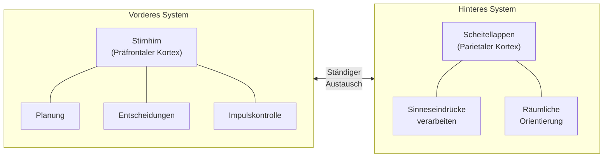
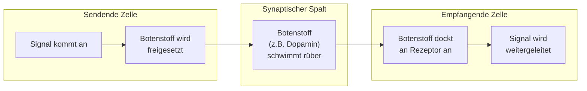
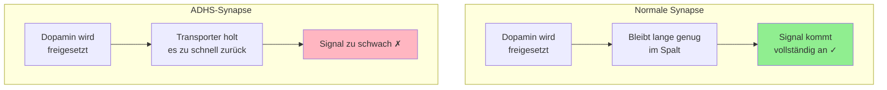
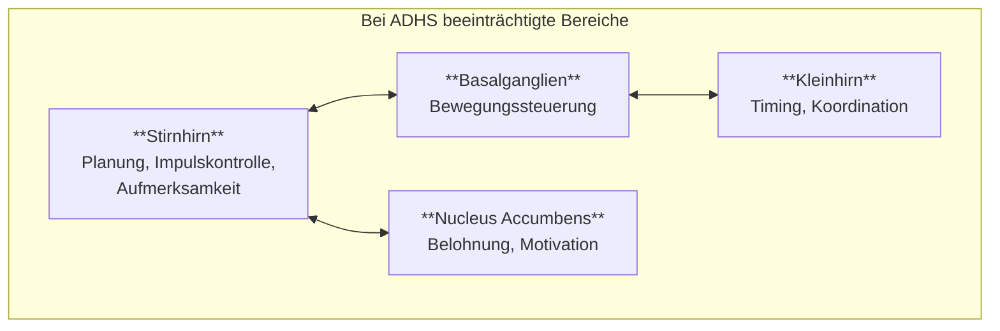
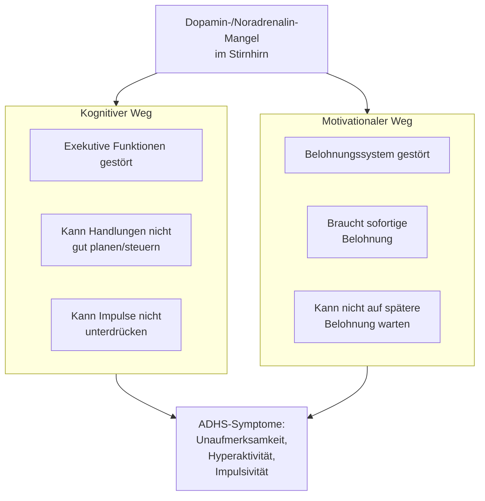
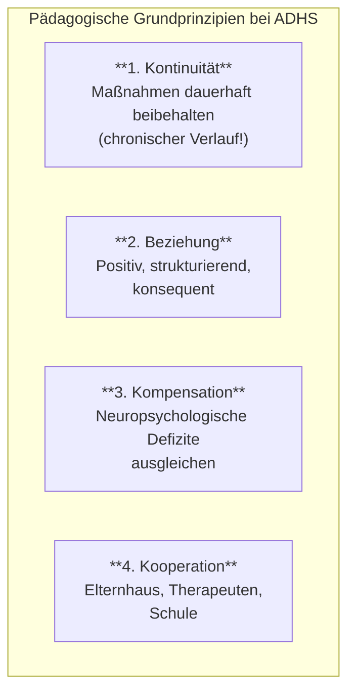
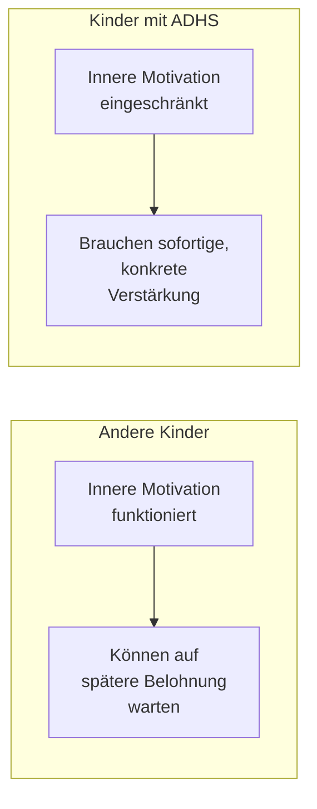
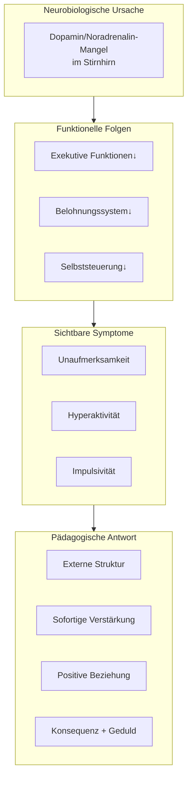

1. Was ist ADHS

## 1.1 Definition nach Diagnosemanualen

→ Download der [Karteikarten](\kolloqium__adhs.apkg)

### Grundlegende Charakterisierung

ADHS (Aufmerksamkeitsdefizit-/Hyperaktivitätsstörung) ist eine psychische Störung, die sich durch drei **Kernsymptome** (Kardinalsymptome) auszeichnet:

|Kernsymptom|Beschreibung|
|---|---|
|**Aufmerksamkeitsschwäche**|Kurze Daueraufmerksamkeitsspanne, hohe Ablenkbarkeit durch äußere Reize, geringe Ausdauer, oberflächliche/unvollständige Anfertigung von Arbeiten, Tagträumen, Vergesslichkeit|
|**Hyperaktivität**|Erhöhte Unruhe und Zappeligkeit, übermäßiger Bewegungsdrang, Unfähigkeit längere Zeit still zu sitzen, Rastlosigkeit, hohes Mitteilungsbedürfnis|
|**Impulsivität**|Spontanes, unreflektiertes Handeln, Ungeduld, häufiges Unterbrechen von Gesprächen, Vordrängen, Neigung zur Waghalsigkeit, Schwierigkeiten planvoll zu handeln|

> **Quelle:** Frölich-Döpfner_ADHS_in_Schulen_und_Unterricht.pdf; Dägling_Gehirn_und_ADHS.md

---

### Die zwei internationalen Klassifikationssysteme

Es existieren zwei anerkannte psychiatrische Klassifikationssysteme:

**ICD (International Classification of Diseases)**

- Herausgegeben von der WHO (World Health Organization)
- Aktuell: ICD-10 (ICD-11 bereits in englischer Fassung publiziert)
- In Deutschland kassenärztlich verbindlich
- Bezeichnet die Störung als **"Hyperkinetische Störung" (HKS)**
- Strengere Kriterien → niedrigere Prävalenzraten (ca. 1–2%)

**DSM (Diagnostic and Statistical Manual of Mental Disorders)**

- Herausgegeben von der APA (American Psychiatric Association)
- Aktuell: DSM-5
- Bezeichnet die Störung als **"ADHS"**
- Weniger strenge Kriterien → höhere Prävalenzraten (ca. 5,3%)

> **Quelle:** Frölich-Döpfner_ADHS_in_Schulen_und_Unterricht.pdf; Reh_Berdelmann_Dinkelaker_Aufmersamkeit_Geschichte-Theorie-Empirie.pdf

---

### Diagnostische Kriterien nach ICD-10

**Symptomkriterien für Unaufmerksamkeit** (mindestens 6 von 9 Symptomen über mindestens 6 Monate):

1. Häufig unaufmerksam gegenüber Details / Sorgfaltsfehler
2. Kann Aufmerksamkeit bei Aufgaben/Spielen nicht aufrechterhalten
3. Hört scheinbar nicht, was gesagt wird
4. Kann Erklärungen nicht folgen / Aufgaben nicht erfüllen
5. Beeinträchtigt bei Organisation von Aufgaben und Aktivitäten
6. Vermeidet Arbeiten, die geistiges Durchhaltevermögen erfordern
7. Verliert häufig Gegenstände (Stifte, Bücher, Spielsachen)
8. Wird häufig von externen Stimuli abgelenkt
9. Ist im Alltag oft vergesslich

Analog werden Symptome für Hyperaktivität (6 Symptome) und Impulsivität (3 Symptome) erfasst.

> **Quelle:** Reh_Berdelmann_Dinkelaker_Aufmersamkeit_Geschichte-Theorie-Empirie.pdf

---

### Zusätzliche diagnostische Kriterien

|Kriterium|ICD-10|DSM-5|
|---|---|---|
|**Dauer**|Symptomkriterien müssen für mindestens 6 Monate erfüllt sein|Identisch|
|**Alter bei Beginn**|Vor dem 6.–7. Lebensjahr|Bis zum 12. Lebensjahr|
|**Persistenz**|Beeinträchtigungen in ≥2 Bereichen (Schule, Familie, Peers)|Identisch|
|**Beeinträchtigung**|Signifikante Beeinträchtigung (z.B. soziale Ausgrenzung, Schulversagen)|Identisch|
|**Diskrepanz**|Symptome deutlich stärker als bei gleichaltrigen Kindern mit gleichem Entwicklungsstand|Identisch|
|**Ausschluss**|Symptome nicht auf andere psychische Erkrankung zurückführbar|Identisch|

> **Quelle:** Frölich-Döpfner_ADHS_in_Schulen_und_Unterricht.pdf (adaptiert nach Steinhausen, Rothenberger & Döpfner, 2010)

---

### Subtypen der ADHS (nach DSM-5 und ICD-11)

|Subtyp|Charakteristik|
|---|---|
|**Primär unaufmerksame Präsentation**|Aufmerksamkeitsprobleme dominieren, weniger Hyperaktivität/Impulsivität|
|**Primär hyperaktiv-impulsive Präsentation**|Hyperaktivität und Impulsivität dominieren|
|**Kombinierte Symptompräsentation**|Alle drei Kernsymptome sind ausgeprägt vorhanden|

> **Quelle:** Frölich-Döpfner_ADHS_in_Schulen_und_Unterricht.pdf

---

### Dimensionale vs. kategoriale Betrachtung

**Zentrale Erkenntnis:** Die Kernsymptome der ADHS sind **Extreme eines Spektrums ganz normaler Verhaltenszüge**. Jedes Kind kann diese Symptome temperaments-, situations- oder reifebezogen zeigen.

Die Grenze zwischen "normal" und "auffällig" ist fließend – vergleichbar mit Bluthochdruck oder Übergewicht. Entscheidend für die Diagnose sind:

1. **Leidensdruck** beim Kind und/oder den Bezugspersonen
2. **Funktionsbeeinträchtigung** in wichtigen Lebensbereichen
3. **Entwicklungsrückstände** im Lern-/Leistungsbereich oder Sozialverhalten

> **Quelle:** Frölich-Döpfner_ADHS_in_Schulen_und_Unterricht.pdf

---

### Prävalenz (Häufigkeit)

- **Weltweite Prävalenz nach DSM-5:** ca. 5,3%
- **Nach ICD-10 (strenger):** ca. 1–2%
- **Geschlechterverhältnis:** Jungen deutlich häufiger diagnostiziert als Mädchen
- **Alterseffekt:** Die jüngsten Kinder einer Klasse erhalten bis zu 26–31% häufiger eine ADHS-Diagnose (Verwechslung mit Unreife!)

> **Quelle:** Frölich-Döpfner_ADHS_in_Schulen_und_Unterricht.pdf

---

##  Wie funktioniert Aufmerksamkeit im Gehirn?

### Die Grundidee

Das Gehirn wird ständig mit Reizen überflutet: Geräusche, Bilder, Gedanken, Körperempfindungen. **Aufmerksamkeit** ist der Mechanismus, der auswählt, welche dieser Reize verarbeitet werden und welche ignoriert werden.

> **Quelle:** Reh_Berdelmann_Dinkelaker_Aufmersamkeit_Geschichte-Theorie-Empirie.pdf

### Zwei Aufmerksamkeitssysteme

Das Gehirn besitzt zwei Systeme, die zusammenarbeiten:

|System|Botenstoff|Hauptfunktion|
|---|---|---|
|Vorderes System|Dopamin|Antrieb, Motivation, Handlungssteuerung|
|Hinteres System|Noradrenalin|Wachheit, Aufmerksamkeitsausrichtung|

> **Quelle:** Frölich-Döpfner_ADHS_in_Schulen_und_Unterricht.pdf

### Wie Nervenzellen kommunizieren

Nervenzellen (Neuronen) sprechen nicht direkt miteinander. Sie schicken sich chemische Botenstoffe über einen winzigen Spalt (die Synapse).

Die wichtigsten Botenstoffe für Aufmerksamkeit:

|Botenstoff|Funktion|
|---|---|
|**Dopamin**|Motivation, Antrieb, Belohnungsempfinden, Bewegungssteuerung|
|**Noradrenalin**|Wachheit, Aufmerksamkeitslenkung|

> **Quelle:** Dägling_Gehirn_und_ADHS.md; Frölich-Döpfner_ADHS_in_Schulen_und_Unterricht.pdf

---

## 2. Was ist bei ADHS anders?

### Das Kernproblem: Zu wenig Botenstoffe verfügbar

Bei ADHS funktioniert die Kommunikation zwischen Nervenzellen nicht optimal. Der Hauptgrund: **Dopamintransporter sind zu aktiv**.

**Vereinfacht gesagt:** Bei ADHS wird der Botenstoff Dopamin zu schnell wieder "aufgesaugt", bevor er seine Wirkung entfalten kann. Dadurch fehlt den zuständigen Hirnregionen der "Treibstoff" für Aufmerksamkeit und Selbststeuerung.

> **Quelle:** Dägling_Gehirn_und_ADHS.md

### Betroffene Hirnregionen

**Wichtiger Befund:** Bei Kindern mit ADHS erreicht das Stirnhirn etwa 3 Jahre später seine volle Reife als bei anderen Kindern.

> **Quelle:** Frölich-Döpfner_ADHS_in_Schulen_und_Unterricht.pdf

### Zwei Wege zur Symptomatik

ADHS entsteht nicht nur durch Aufmerksamkeitsprobleme. Es gibt zwei Erklärungswege:

> **Quelle:** Frölich-Döpfner_ADHS_in_Schulen_und_Unterricht.pdf

### Die wichtigsten Funktionseinschränkungen

|Bereich|Was ist eingeschränkt|Wie zeigt sich das?|
|---|---|---|
|Reaktionshemmung|Impulse unterdrücken|Platzt mit Antworten heraus, kann nicht warten|
|Arbeitsgedächtnis|Informationen kurz behalten|Vergisst Anweisungen, verliert den Faden|
|Kognitive Flexibilität|Zwischen Aufgaben wechseln|Kommt schwer aus einer Tätigkeit heraus|
|Zeitverarbeitung|Zeit richtig einschätzen|Verplant sich ständig, kommt zu spät|
|Belohnungsaufschub|Auf spätere Belohnung warten|Will alles sofort, keine Geduld|

> **Quelle:** Frölich-Döpfner_ADHS_in_Schulen_und_Unterricht.pdf

### Das Default Mode Network

Neuere Forschung zeigt: Es gibt auch ein Problem mit dem "Tagtraum-Netzwerk" (Default Mode Network).

|Zustand|Bei den meisten Menschen|Bei ADHS|
|---|---|---|
|Ruhe/Tagträumen|Tagtraum-Netzwerk aktiv|Tagtraum-Netzwerk aktiv|
|Aufgabe bearbeiten|Tagtraum-Netzwerk schaltet ab|Tagtraum-Netzwerk bleibt teilweise aktiv|

**Folge:** Gedanken schweifen ab, mehr Fehler, längere Reaktionszeiten.

> **Quelle:** Frölich-Döpfner_ADHS_in_Schulen_und_Unterricht.pdf

---

## 3. Was bedeutet das für die Pädagogik?

### Die zentrale Erkenntnis

ADHS ist **keine Erziehungsfrage** und **kein Unwille**. Es handelt sich um eine neurobiologisch bedingte Störung der Selbststeuerung. Betroffene können nicht einfach "sich zusammenreißen".

> **Quelle:** Frölich-Döpfner_ADHS_in_Schulen_und_Unterricht.pdf

### Vier Grundprinzipien für den pädagogischen Umgang

> **Quelle:** Frölich-Döpfner_ADHS_in_Schulen_und_Unterricht.pdf

### Konkrete pädagogische Konsequenzen

#### Aus dem Dopamin-Defizit folgt:

|Problem|Pädagogische Antwort|
|---|---|
|Motivation kommt nicht "von innen"|**Äußere Anreize** konsequent und häufig einsetzen|
|Späte Belohnung wirkt nicht|**Sofortige, unmittelbare** Rückmeldung geben|
|Normale Verstärker reichen nicht|**Stärkere, konkretere** Verstärker verwenden|

#### Aus den exekutiven Defiziten folgt:

|Problem|Pädagogische Antwort|
|---|---|
|Kann nicht lange planen|**Aufgaben kleinschrittig** strukturieren|
|Vergisst Anweisungen|**Schriftliche Erinnerungen**, Checklisten|
|Kann sich nicht selbst organisieren|**Externe Struktur** vorgeben (Zeitpläne, Routinen)|
|Kann Impulse nicht hemmen|**Klare Regeln**, konsequente (nicht harte) Konsequenzen|

#### Aus dem Default-Mode-Problem folgt:

|Problem|Pädagogische Antwort|
|---|---|
|Gedanken schweifen ab|**Häufiger Blickkontakt**, direkt ansprechen|
|Verliert sich in Tagträumen|**Aufgaben aktivierend** gestalten, Wechsel einbauen|

> **Quelle:** Frölich-Döpfner_ADHS_in_Schulen_und_Unterricht.pdf

### Verstärkersysteme: Warum sie bei ADHS besonders wichtig sind

Das gestörte Belohnungssystem erklärt, warum Kinder mit ADHS **viel mehr externe Motivation** brauchen als andere:

**Praktische Umsetzung:**

- Verstärkerpunktepläne (Token-Systeme)
- Tages-/Wochenrückmeldungen
- Sofortige positive Rückmeldung für erwünschtes Verhalten
- Verhaltensverträge mit klaren, erreichbaren Zielen

> **Quelle:** Frölich-Döpfner_ADHS_in_Schulen_und_Unterricht.pdf

### Was NICHT funktioniert

|Unwirksam|Warum|
|---|---|
|"Reiß dich zusammen!"|Setzt voraus, was neurobiologisch eingeschränkt ist|
|Nur Strafen|Wirken kurzfristig, zerstören Beziehung|
|Lange Ermahnungen|Werden nicht verarbeitet (Arbeitsgedächtnis!)|
|Vage Ankündigungen|Brauchen konkrete, sofortige Konsequenzen|
|Ausschließlich spätere Belohnungen|Motivationssystem reagiert nicht darauf|

> **Quelle:** Frölich-Döpfner_ADHS_in_Schulen_und_Unterricht.pdf

---

## Zusammenfassung

**Kernbotschaft:** ADHS ist keine Charakterschwäche, sondern eine Entwicklungsstörung der Selbststeuerung. Pädagogisches Handeln muss die neurobiologischen Einschränkungen **kompensieren** – nicht durch Appelle an den Willen, sondern durch Struktur, sofortige Verstärkung und eine tragfähige Beziehung.

> **Quellen:** Frölich-Döpfner_ADHS_in_Schulen_und_Unterricht.pdf; Dägling_Gehirn_und_ADHS.md