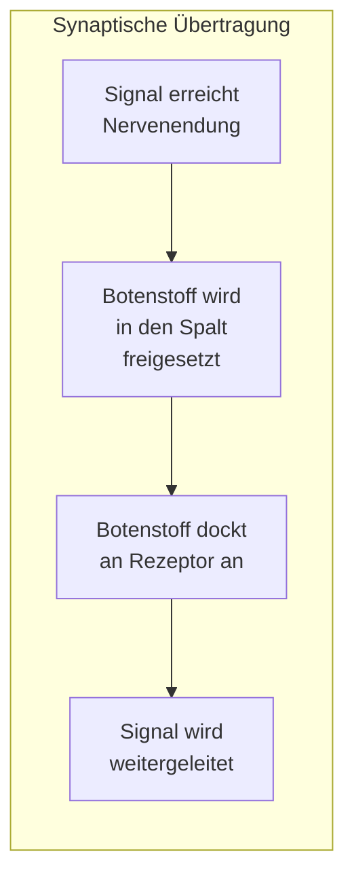
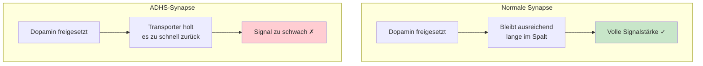
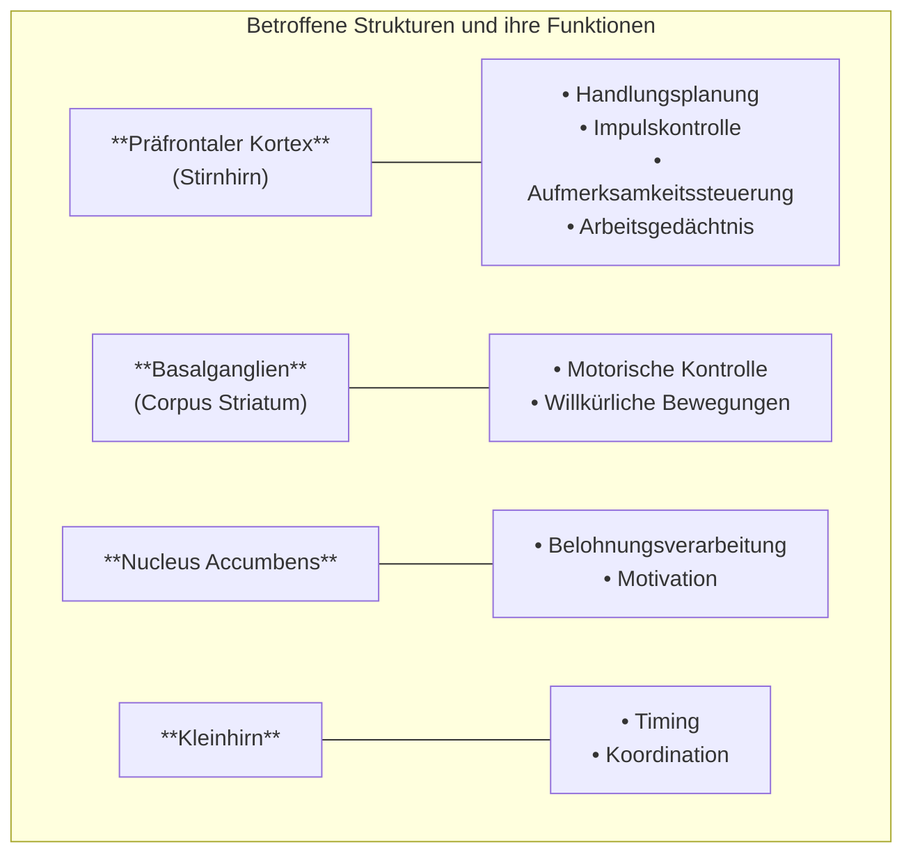
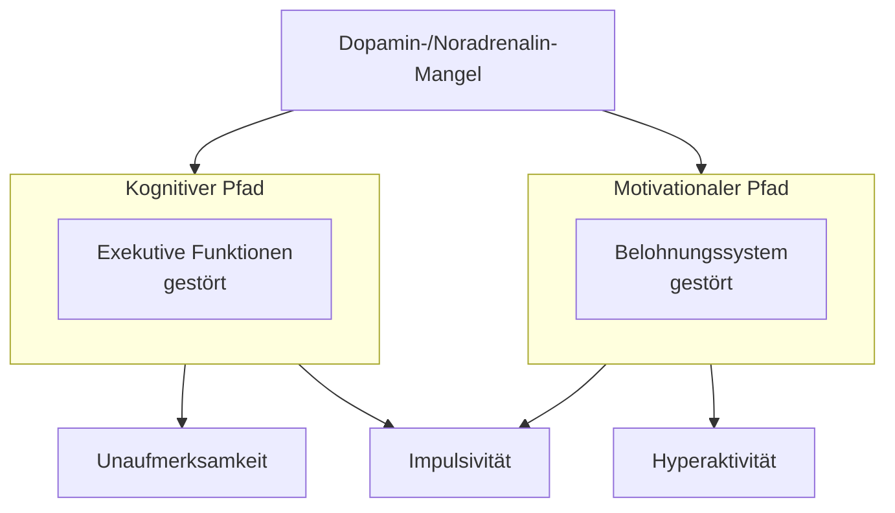
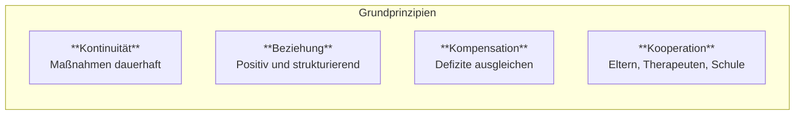
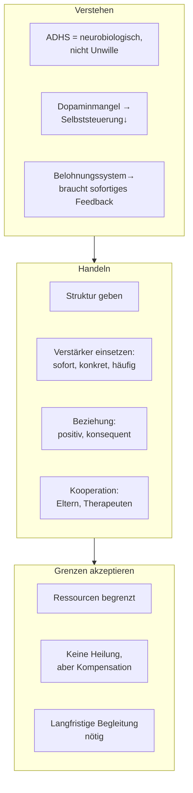

# ADHS: Grundlagen und Pädagogik

{button: (⬇️ Download Karteikarten - ADHS)(kolloqium__adhs.apkg)}
## 1. Was ist ADHS?

### Definition

ADHS (Aufmerksamkeitsdefizit-Hyperaktivitätsstörung) ist eine **neurobiologisch bedingte Entwicklungsstörung der Selbststeuerung**.
Kardinalsymptome: 
- Aufmerksamkeitsschwäche
- Impulsivität
- motorische Hyperaktivität

**Symptome:**
- situationsübergreifend, aber nicht in allen Situationen, 
- für das Alter und den Entwicklungsstand in unangemessenem Ausmaß 
- zeitlich überdauernd auftreten
- i.d.R. rückverfolgbar bis in die frühe Kindheit
- nicht durch andere Störungsbilder bedingt
- Beeinträchtigung wichtiger Alltagsfunktionen und des seelischen Befindens

*ADHS ist keine Frage der Erziehung, des Willens oder der Intelligenz. Die Störung hat eine hohe genetische Komponente (Erblichkeit: 0.76 – vergleichbar mit der Körpergröße) und geht mit nachweisbaren Veränderungen der Hirnstruktur und -funktion einher.*

> **Quelle:** Frölich-Döpfner_ADHS_in_Schulen_und_Unterricht.pdf

### Klassifikation

Die Diagnose erfolgt nach ICD-10 (Hyperkinetische Störung) oder DSM-5 (ADHS). Unterschieden werden drei Erscheinungsformen:

|Typ|Kennzeichen|
|---|---|
|Vorwiegend unaufmerksam|Konzentrationsprobleme, Vergesslichkeit, leichte Ablenkbarkeit|
|Vorwiegend hyperaktiv-impulsiv|Motorische Unruhe, Schwierigkeiten beim Warten, vorschnelles Handeln|
|Kombiniert|Beide Symptomcluster ausgeprägt|

### Prävalenz

Etwa **5% aller Kinder und Jugendlichen** sind betroffen. Jungen werden häufiger diagnostiziert (Verhältnis ca. 3:1), wobei Mädchen oft den vorwiegend unaufmerksamen Typ zeigen und daher unterdiagnostiziert sein können.

---

## 2. Neurologische Grundlagen

*Dieses Kapitel erklärt, **warum** Schüler mit ADHS bestimmte Verhaltensweisen zeigen. Ist Voraussetzung für wirksame Intervention.*

### 2.1 Das Grundprinzip: Kommunikation zwischen Nervenzellen

Nervenzellen kommunizieren über chemische Botenstoffe (Neurotransmitter). Diese werden an Kontaktstellen (Synapsen) freigesetzt, überbrücken einen winzigen Spalt und docken an der nächsten Zelle an, um das Signal weiterzuleiten.

Die beiden wichtigsten Botenstoffe für Aufmerksamkeit und Selbststeuerung:

|Botenstoff|Funktion|
|---|---|
|**Dopamin**|Motivation, Antrieb, Belohnungsverarbeitung, Handlungsplanung|
|**Noradrenalin**|Wachheit, Aufmerksamkeitslenkung|

### 2.2 Das Kernproblem bei ADHS: Dopamin wird zu schnell recycelt

Bei ADHS arbeiten die **Dopamintransporter** zu effektiv. Diese Transporter holen den freigesetzten Botenstoff zu schnell aus dem synaptischen Spalt zurück, bevor er seine volle Wirkung entfalten kann.

**Konsequenz:** In den für Aufmerksamkeit und Selbststeuerung zuständigen Hirnregionen steht nicht genügend Dopamin zur Verfügung.

> **Quelle:** Dägling_Gehirn_und_ADHS.md

### 2.3 Betroffene Hirnregionen

Diese Regionen sind über Regelkreisläufe verbunden. Bei ADHS ist dieser [**fronto-striatale Regelkreislauf**](https://de.wikipedia.org/wiki/Striatofrontale_Dysfunktion#Striatofrontale_Dysfunktion_bei_ADHS) gestört. 

>[!quote] **Entwicklungsbefund:** Bei Kindern mit ADHS erreicht der präfrontale Kortex seine volle Reife etwa **3 Jahre später** als bei nicht betroffenen Kindern.
>
>Eine Anzahl von Befunden konnte nachweisen, dass bei Kindern mit einer ADHS eine Reifungsverzögerung in der Entwicklung der genannten neuroanatomischen Strukturen vorliegt (Renner et al., 2008). Shaw et al. (2007) verglichen in einer prospektiven Studie die Hirnscans von 223 von einer ADHS betroffenen Kindern und Jugendlichen mit denen von 223 gesunden Probanden im Entwicklungsverlauf. Obwohl die zerebrale Reifung bei von ADHS Betroffenen insgesamt alterstypisch verlief, erreichten die Betroffenen erst ca. drei Jahre später eine den gesunden Kindern vergleichbare kortikale Dicke im gesamten Gehirn, vor allen Dingen aber im sogenannten präfrontalen Cortex.

### 2.4 Das Default Mode Network (Tagtraum-Netzwerk)

Ein neuerer Befund: Das Gehirn besitzt ein Netzwerk, das im Ruhezustand aktiv ist (beim Tagträumen, ziellosem Nachdenken). Bei Aufgabenbearbeitung sollte es sich abschalten.
Bei ADHS funktioniert das nur eingeschränkt, Fokussierung ist dabei eingeschränkt, Gedanken schweifen eher ab. 

### 2.5 Pädagogische Kernbotschaft der Neurobiologie

|Neurobiologischer Befund|Was das für die Praxis bedeutet|
|---|---|
|Dopaminmangel im Stirnhirn|Selbststeuerung ist neurobiologisch eingeschränkt, nicht Unwille|
|Gestörtes Belohnungssystem|Braucht externe, sofortige Verstärkung – späte Belohnung wirkt nicht|
|Verzögerte Hirnreifung|Entwicklungsstand ist jünger als das chronologische Alter|
|Tagtraum-Netzwerk bleibt aktiv|Ablenkung ist keine bewusste Entscheidung|

---

## 3. Symptome – neurobiologisch erklärt

### 3.1 Zwei Erklärungswege

ADHS-Symptome entstehen auf zwei Wegen, die beide auf dem Dopaminmangel basieren:

> **Quelle:** Frölich-Döpfner_ADHS_in_Schulen_und_Unterricht.pdf

### 3.2 Exekutive Funktionen: Was genau ist gestört?

Exekutive Funktionen sind übergeordnete Steuerungsprozesse. Bei ADHS sind sie beeinträchtigt:

|Funktion|Was sie leistet|Wie sich die Störung zeigt|
|---|---|---|
|**Reaktionshemmung**|Impulse unterdrücken|Platzt mit Antworten heraus, handelt ohne nachzudenken|
|**Arbeitsgedächtnis**|Informationen kurz behalten und verarbeiten|Vergisst Anweisungen, verliert den Faden|
|**Kognitive Flexibilität**|Zwischen Aufgaben/Denkweisen wechseln|Bleibt an einer Sache hängen, kommt schwer raus|
|**Interferenzkontrolle**|Störreize ausblenden|Wird von allem abgelenkt|
|**Planungsfähigkeit**|Schritte vorausdenken, organisieren|Chaotisches Arbeiten, vergisst Material|
|**Zeitverarbeitung**|Zeit einschätzen|Verplant sich ständig, Zeitgefühl fehlt|

> **Quelle:** Frölich-Döpfner_ADHS_in_Schulen_und_Unterricht.pdf

### 3.3 Das Belohnungssystem: Verzögerungsaversion

Das dopaminerge Belohnungssystem ist bei ADHS dysfunktional. Konkret:

- **Sofortige Belohnung** wird stark bevorzugt
- **Aufgeschobene Belohnung** (auch wenn größer) verliert ihren Anreiz
- **Verstärkte Suche nach Stimulation** – braucht stärkere Reize

**Praktische Folge:** Normale pädagogische Anreize wie „Wenn du fleißig lernst, bekommst du eine gute Note" oder „Das brauchst du später im Beruf" funktionieren nicht ausreichend.

> **Quelle:** Frölich-Döpfner_ADHS_in_Schulen_und_Unterricht.pdf

### 3.4 Symptomübersicht mit neurobiologischer Erklärung

|Symptom|Neurobiologische Ursache|Sichtbares Verhalten|
|---|---|---|
|Unaufmerksamkeit|Interferenzkontrolle ↓, Tagtraum-Netzwerk aktiv|Träumt, macht Flüchtigkeitsfehler, hört nicht zu|
|Hyperaktivität|Motorische Kontrolle ↓, Stimulationssuche ↑|Zappelt, steht auf, redet viel|
|Impulsivität|Reaktionshemmung ↓|Unterbricht, handelt vorschnell, riskantes Verhalten|
|Desorganisation|Planungsfähigkeit ↓, Arbeitsgedächtnis ↓|Vergisst Material, chaotische Hefte, verpasst Fristen|
|Motivationsprobleme|Belohnungssystem dysfunktional|Wirkt faul, gibt schnell auf, braucht sofortiges Feedback|

---

## 4. Pädagogischer Umgang

### 4.1 Vier Grundprinzipien

> **Quelle:** Frölich-Döpfner_ADHS_in_Schulen_und_Unterricht.pdf

### 4.2 Individuelle Maßnahmen für den einzelnen Schüler

#### Strukturelle Maßnahmen

|Maßnahme|Begründung|
|---|---|
|**Sitzplatz vorne, nah bei der Lehrkraft**|Geringeres Ablenkungspotenzial, bessere Überwachung|
|**Einzelplatz oder ruhiger Nachbar**|Weniger soziale Ablenkung|
|**Keine Sitzplatzrotation**|Konstanz wichtiger als soziale Integration|
|**Reizarme Umgebung**|Interferenzkontrolle ist eingeschränkt|
|**Kopfhörer bei Stillarbeit**|Auditive Ablenkung reduzieren|

#### Kommunikation und Anweisungen

|Strategie|Umsetzung|
|---|---|
|**Aufmerksamkeit sichern**|Vor der Anweisung: Blickkontakt, ggf. Name nennen, ggf. leichte Berührung|
|**Kurz und klar**|Einfache Sätze, wenige Schritte gleichzeitig|
|**Multisensorisch**|Verbal + visuell (Tafel, Symbole)|
|**Verständnis prüfen**|Schüler wiederholen lassen|
|**Schriftliche Erinnerung**|Checklisten, Tafelanschrieb für Aufgaben|

#### Verstärkersysteme (neurobiologisch begründet)

Da das Belohnungssystem bei ADHS dysfunktional ist, brauchen Betroffene **mehr externe Motivation**:

|Prinzip|Begründung|Umsetzung|
|---|---|---|
|**Sofort**|Verzögerte Belohnung wirkt nicht|Unmittelbare Rückmeldung, keine Wochenbelohnungen ohne Zwischenschritte|
|**Konkret**|Abstrakte Ziele motivieren nicht|Punkte, Stempel, kleine Privilegien|
|**Häufig**|Motivation erschöpft sich schnell|Viele kleine Verstärker, nicht wenige große|
|**Positiv vor negativ**|Beziehung erhalten|Verhältnis 3:1 (positiv:negativ) anstreben|

**Beispiele für schulische Verstärker:**

- Freizeit für eigene Aktivitäten (Zeichnen, Spielen)
- Assistenzrolle (Tafeldienst, Botengänge)
- Gemeinsames Spiel mit Mitschülern
- Arbeiten mit besonderen Materialien

> **Quelle:** Frölich-Döpfner_ADHS_in_Schulen_und_Unterricht.pdf

#### Umgang mit Regelverstößen

|Prinzip|Umsetzung|
|---|---|
|**Konsequent, aber ruhig**|Emotionale Reaktionen eskalieren|
|**Zeitnah**|Verzögerte Konsequenzen verlieren Wirkung|
|**Verhaltens-, nicht personenbezogen**|„Dein Verhalten war nicht okay" statt „Du bist unmöglich"|
|**Kurz**|Lange Ermahnungen werden nicht verarbeitet (Arbeitsgedächtnis!)|
|**Keine Minuspunkte ins Minus**|Nicht unter Null gehen – sonst Motivationsverlust|

### 4.3 Classroom Management – Anpassungen für die ganze Klasse

Viele Maßnahmen, die Schülern mit ADHS helfen, verbessern das Lernen für alle:

#### Unterrichtsstruktur

|Element|Begründung|
|---|---|
|**Klare Routinen**|Entlasten das Arbeitsgedächtnis|
|**Rituale für Übergänge**|Übergänge sind kritische Phasen (bis 25% der Unterrichtszeit, doppelt so viel Fehlverhalten)|
|**Aktivitäten sauber beenden**|Nicht „flip-floppen" zwischen Aufgaben|
|**Strukturierter Tafelanschrieb**|Orientierung geben|

#### Aufmerksamkeitssteuerung

|Strategie|Umsetzung|
|---|---|
|**Gruppenfokus halten**|Alle aktiv einbinden, nicht nur Einzelne „vorrechnen" lassen|
|**Signalkontinuität**|Durchgängige Hinweise, was gerade zu tun ist|
|**Monitoring**|Aufmerksamkeitsverlust früh erkennen (Blick schweifen lassen)|
|**Leichte Störungen ignorieren**|Nicht jede Störung unterbricht den Fluss|

#### Proaktives Handeln

|Prinzip|Umsetzung|
|---|---|
|**Antizipieren**|Wo werden Probleme auftreten? (Übergänge, Freiarbeit, Ende der Medikamentenwirkung)|
|**Individuell aufsuchen**|Nach Aufgabenstellung zum Schüler gehen, Verständnis prüfen, beim Start helfen|
|**Verhaltensanalyse**|Systematisch beobachten: Wann, wo, mit wem treten Probleme auf?|

> **Quellen:** Reh_Berdelmann_Dinkelaker_Aufmersamkeit_Geschichte-Theorie-Empirie.pdf; Frölich-Döpfner_ADHS_in_Schulen_und_Unterricht.pdf

### 4.4 Was nicht funktioniert

|Unwirksame Strategie|Warum nicht|
|---|---|
|„Reiß dich zusammen!"|Setzt voraus, was neurobiologisch eingeschränkt ist|
|Ausschließlich Strafen|Beschädigen Beziehung, ohne Alternative aufzuzeigen|
|Lange Ermahnungen|Arbeitsgedächtnis zu schwach|
|Vage Ankündigungen|„Wenn das so weitergeht…" – keine Wirkung ohne konkrete Konsequenz|
|Nur späte Belohnung|Belohnungssystem reagiert nicht auf Aufschub|
|Sonderbehandlung vor der Klasse|Stigmatisierung|
|Ignorieren der Störung|Problem verschwindet nicht von allein|

---

## 5. Grenzen der Anpassung im schulischen System

### 5.1 Rechtliche Rahmenbedingungen

**Nachteilsausgleich bei ADHS:**

- **Kein gesetzlicher Anspruch** auf Nachteilsausgleich bei ADHS in Deutschland
- Gewährung liegt im Ermessen der Schule nach Konferenzbeschluss
- Beantragung durch Eltern mit ärztlichem Attest erforderlich
- Fachliche Anforderungen dürfen **nicht gesenkt** werden

**Mögliche Maßnahmen des Nachteilsausgleichs:**

- Zeitzuschlag (bis max. 50% zusätzlich)
- Angepasste Aufgabengestaltung (z.B. auf mehrere Seiten verteilt)
- Technische Hilfsmittel (z.B. Laptop)
- Mündliche statt schriftliche Prüfungen
- Individuelle Pausenregelungen
- Reduktion der Hausaufgaben

> **Quelle:** Frölich-Döpfner_ADHS_in_Schulen_und_Unterricht.pdf

### 5.2 Systemische Grenzen an der Mittelschule

|Grenze|Auswirkung|
|---|---|
|**Klassengröße**|Individuelle Betreuung zeitlich kaum leistbar (20–28 Schüler)|
|**Fachlehrerprinzip**|Viele wechselnde Bezugspersonen erschweren Kontinuität|
|**Zeitdruck durch Lehrplan**|Wenig Spielraum für individuelle Förderung|
|**Fehlende Fortbildung**|Viele Lehrkräfte ohne spezifisches ADHS-Wissen|
|**Keine verbindlichen Leitlinien**|Maßnahmen hängen vom Engagement Einzelner ab|
|**Ressourcenmangel**|Integrationskräfte, Beratungslehrer nicht flächendeckend verfügbar|

### 5.3 Kooperationsprobleme

In der Praxis scheitert wirksame Förderung oft an mangelnder Kooperation:

**Schulseite:**

- Diagnosen werden angezweifelt
- Nachteilsausgleich wird nicht umgesetzt
- Zusammenarbeit mit Therapeuten unterbleibt

**Elternseite:**

- Unrealistische Erwartungen an individuelle Zuwendung
- Verzögerung der Abklärung trotz Hinweisen der Schule
- Ablehnung empfohlener Behandlung

**Fehlende Algorithmen:** Es gibt keine verbindlichen schulpädagogischen Leitlinien für den Umgang mit ADHS. Maßnahmen bleiben abhängig von individuellen Einstellungen.

> **Quelle:** Frölich-Döpfner_ADHS_in_Schulen_und_Unterricht.pdf

### 5.4 Bayern-spezifische Situation

In Bayern gilt für die Mittelschule:

- **Keine ADHS-spezifischen Regelungen** auf Landesebene
- Nachteilsausgleich nach Art. 52 BayEUG möglich, aber nicht ADHS-spezifisch geregelt
- Entscheidung über Maßnahmen liegt bei der Klassenkonferenz
- **Sonderpädagogischer Förderbedarf** kann beantragt werden bei schwerer Beeinträchtigung – führt ggf. zu Förderschulzuweisung oder inklusiver Beschulung mit Unterstützung
- **Jugendhilfemaßnahmen** (Integrationshilfe, Tagesgruppe) nur bei erheblichem Bedarf und über Jugendamt

### 5.5 Pragmatische Konsequenz

Was bleibt unter diesen Bedingungen möglich:

|Ebene|Machbar ohne Zusatzressourcen|
|---|---|
|**Sitzordnung**|Ja – liegt in Lehrerhand|
|**Klare Strukturen**|Ja – profitiert die ganze Klasse|
|**Kurze, klare Anweisungen**|Ja – Methodenfrage|
|**Proaktives Aufsuchen**|Bedingt – bei 25+ Schülern zeitlich begrenzt|
|**Verstärkerpläne**|Bedingt – erfordert Einarbeitungszeit|
|**Enge Elternkooperation**|Bedingt – abhängig von Elternbereitschaft|
|**Individueller Nachteilsausgleich**|Nur mit Antrag und Konferenzbeschluss|
|**Integrationshilfe**|Nur über Jugendamt bei erheblichem Bedarf|

**Kernbotschaft:** Auch unter eingeschränkten Rahmenbedingungen sind wirksame Maßnahmen möglich. Der größte Hebel liegt in der Haltung: ADHS als neurobiologische Störung verstehen, nicht als Provokation. Strukturen geben, Beziehung halten, Kooperation suchen.

---

## Zusammenfassung

![[Multimodale Therapie nach Döpfner.png]]