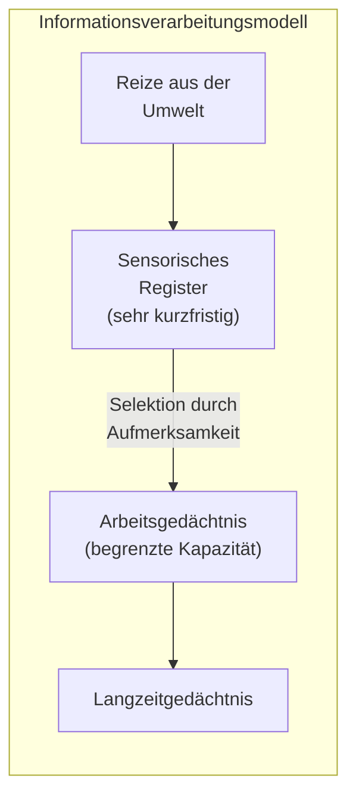
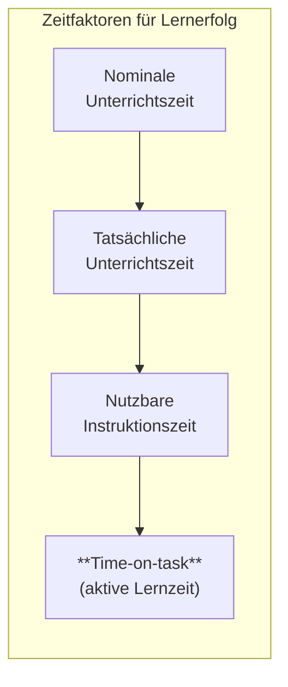
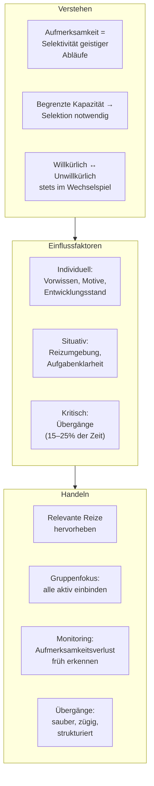

# Aufmerksamkeit: Grundlagen und Pädagogik
## 1. Was ist Aufmerksamkeit?

{button: (⬇️ Download Karteikarten - Aufmerksamkeit)(kolloqium__aufmerksamkeit.apkg)}
### Definition

Aufmerksamkeit bezeichnet in der modernen Psychologie die **Selektivität geistiger Abläufe**. Zu jedem Zeitpunkt wird vom Menschen nur ein Teil der verfügbaren Informationen verarbeitet. Diese Selektivität betrifft nicht nur die Wahrnehmung, sondern alle psychischen Prozesse: Erinnern, Handeln, Problemlösen.

Aufmerksamkeit ist dabei **kein einzelner Mechanismus**, sondern ein beschreibender Begriff für verschiedene Formen dieser Selektion. Je nach Aufgabe kann dieselbe Selektion ganz unterschiedlichen Zwecken dienen – etwa dem gezielten Suchen oder dem Ignorieren ein und desselben Merkmals.

> **Quelle:** Ansorge-Leder_Wahrnehmung_und_Aufmerksamkeit.pdf; Reh_Berdelmann_Dinkelaker_Aufmersamkeit_Geschichte-Theorie-Empirie.pdf (Ansorge & Schober)

### Zwei Formen der Aufmerksamkeit

|Form|Bezeichnung|Beschreibung|Beispiel|
|---|---|---|---|
|**Unwillkürlich**|Bottom-up / reizbasiert / primäre Aufmerksamkeit|Wird durch äußere Reize ausgelöst, ohne bewusste Absicht|Ein lautes Geräusch zieht die Aufmerksamkeit auf sich|
|**Willkürlich**|Top-down / zielgesteuert / sekundäre Aufmerksamkeit|Wird bewusst und absichtlich auf etwas gerichtet|Ein Schüler konzentriert sich gezielt auf eine Rechenaufgabe|

Beide Formen sind **nicht voneinander unabhängig**: Willkürliche Aufmerksamkeit baut stets auf einem bereits bestehenden passiv-sensorischen Untergrund auf. Gleichzeitig kann die unwillkürliche Aufmerksamkeit jederzeit die willkürliche unterbrechen – etwa wenn ein plötzlicher Reiz ablenkt.

> **Quelle:** Reh_Berdelmann_Dinkelaker_Aufmersamkeit_Geschichte-Theorie-Empirie.pdf (Wehrle & Breyer)

### Aufmerksamkeit als Phänomen der Bildung

Aufmerksamkeit ist eine Grundvoraussetzung kognitiver Prozesse. Philosophisch betrachtet ist sie eine Form der bewussten Zuwendung zur Welt: Das Bewusstsein kann immer nur **einen** Inhalt fokussieren und drängt alles andere in den Hintergrund. Aufmerksamkeit für eines bedeutet zwangsläufig **Nicht-Aufmerksamkeit für anderes**.

> **Quelle:** Reh_Berdelmann_Dinkelaker_Aufmersamkeit_Geschichte-Theorie-Empirie.pdf (Kade)

---

## 2. Psychologische und neurologische Grundlagen

### 2.1 Warum ist Aufmerksamkeit selektiv?

Die psychologische Forschung diskutiert zwei Erklärungsmodelle für die Selektivität:

|Theorie|Kernaussage|Konsequenz|
|---|---|---|
|**Kapazitätstheorie**|Das kognitive Fassungsvermögen des Geistes ist **begrenzt**. Selektivität ist die Folge dieses Mangels.|Wenn zwei Aufgaben gleichzeitig bearbeitet werden, verschlechtert sich die Leistung in mindestens einer davon.|
|**Tätigkeitstheorie**|Selektivität ist keine Schwäche, sondern eine **Errungenschaft**. Sie ermöglicht erst erfolgreiches Handeln.|Der Engpass liegt nicht im Geist, sondern bei den Effektoren (z.B. Hände, Augen). Handlungssteuerung erfordert Auswahl.|

Beide Erklärungen haben experimentelle Belege. Entscheidend für die Praxis: Die Interferenz zwischen zwei gleichzeitigen Aufgaben steigt, je ähnlicher sie sich in ihren sensorischen und motorischen Anforderungen sind. Zudem lässt sich gegenseitige Störung durch **Übung** deutlich reduzieren.

> **Quelle:** Ansorge-Leder_Wahrnehmung_und_Aufmerksamkeit.pdf; Reh_Berdelmann_Dinkelaker_Aufmersamkeit_Geschichte-Theorie-Empirie.pdf (Ansorge & Schober)

### 2.2 Aufmerksamkeit im Informationsverarbeitungsmodell

Die Notwendigkeit der Aufmerksamkeitsfokussierung ergibt sich direkt aus der **beschränkten Kapazität** des sensorischen Registers und des Arbeitsgedächtnisses. Aus der Vielzahl der Reize, die nur für sehr kurze Zeit im sensorischen Register gespeichert werden, müssen relevante Reize für die Weiterverarbeitung im Arbeitsgedächtnis ausgewählt werden. Dazu muss Aufmerksamkeit aufgewendet werden.

> **Quelle:** Reh_Berdelmann_Dinkelaker_Aufmersamkeit_Geschichte-Theorie-Empirie.pdf (Ophardt & Thiel)

### 2.3 Das Filtermodell (Broadbent)

Ein einflussreiches Modell stammt von Donald Broadbent: Er beschrieb Aufmerksamkeit als einen **Filter**, der Information zur Weiterverarbeitung durch einen Kanal begrenzter Kapazität auswählt. Die Selektion erfolgt dabei anhand physikalischer Merkmale (z.B. Stimmlage, Position).

Spätere Forschung (u.a. Anne Treisman) zeigte, dass auch **Teile der Bedeutung** nicht beachteter Reize durchdringen – etwa der eigene Name in einem nicht beachteten Gespräch (Cocktail-Party-Effekt). Informationen werden also nicht komplett herausgefiltert, sondern eher **gedämpft**.

> **Quelle:** Ansorge-Leder_Wahrnehmung_und_Aufmerksamkeit.pdf; Dägling_Gehirn_und_ADHS.md

### 2.4 Kontrollierte vs. automatische Verarbeitung

|Merkmal|Kontrollierte Verarbeitung|Automatische Verarbeitung|
|---|---|---|
|**Kapazitätsbedarf**|Hoch – beansprucht begrenzte Ressourcen|Gering – kapazitätsfrei|
|**Bewusstsein**|Erfordert bewusste Überwachung|Läuft ohne Bewusstsein ab|
|**Steuerung**|Willentlich, absichtsgebunden (top-down)|Unwillkürlich, ohne Absicht|
|**Geschwindigkeit**|Langsam|Schnell|
|**Typisch für**|Neue, ungeübte Aufgaben|Überlernte, routinierte Abläufe|

**Entscheidend:** Durch ausreichende Übung kann kontrollierte Verarbeitung in automatische übergehen. Ein ungeübter Leser muss sich z.B. bewusst die Lautfolge jedes Buchstabens abrufen; ein geübter Leser erkennt ganze Wortbilder automatisch.

> **Quelle:** Ansorge-Leder_Wahrnehmung_und_Aufmerksamkeit.pdf

### 2.5 Neurologische Verortung

Die willkürliche Aufmerksamkeitssteuerung ist wesentlich an den **präfrontalen Kortex** gebunden (→ siehe ). Das limbische System – insbesondere Amygdala und Hippocampus – beeinflusst die Aufmerksamkeit über Emotionen und Motivation: Emotional aufgeladene Reize werden bevorzugt verarbeitet, weil das limbische System sensorische Informationen mit gespeicherten Erfahrungen abgleicht und ihnen Bedeutung zuweist.

> **Quelle:** Lernpsychologie_1_Neurobiologische_Grundlagen_von_Lernen_und_Ged_chtnis.pdf

---

## 3. Bedeutung von Aufmerksamkeit für Lernen und Schule

### 3.1 Aufmerksamkeit als Voraussetzung für Lernzeit

Aufmerksamkeit gilt als **zentrale Determinante individueller Leistungsentwicklung**. In der Unterrichtsqualitätsforschung ist dabei der Begriff **time-on-task** entscheidend: die Zeit, die ein Schüler tatsächlich aufmerksam mit einer Lernaufgabe verbringt.

Die aktive Lernzeit wird durch individuelle Voraussetzungen **und** durch die Gestaltung des Unterrichts direkt beeinflusst. Klassenmanagement zielt darauf ab, diese aktive Lernzeit zu maximieren.

> **Quelle:** Reh_Berdelmann_Dinkelaker_Aufmersamkeit_Geschichte-Theorie-Empirie.pdf (Ophardt & Thiel)

### 3.2 Aufmerksamkeit als kollektive Steuerungsaufgabe

Die besondere Herausforderung im Unterricht besteht darin, **individuelle** Aufmerksamkeitsprozesse **kollektiv** zu steuern – also möglichst alle Schüler auf ein gemeinsames, durch Lernziel und Aufgabe definiertes Handlungsprogramm auszurichten. Dies unterscheidet schulische Aufmerksamkeitssteuerung grundlegend von individuellen Lernsituationen.

Erschwerend kommt hinzu, dass die Schulklasse für Schüler nicht nur ein Lernort ist, sondern gleichzeitig ein **sozialer Resonanzraum**: Die Filtereinstellung der Schüler ist mit hoher Wahrscheinlichkeit nicht allein auf lernwirksame Reize ausgerichtet, sondern auch auf soziale Vergleiche, Beziehungen und Selbstwertregulation.

> **Quelle:** Reh_Berdelmann_Dinkelaker_Aufmersamkeit_Geschichte-Theorie-Empirie.pdf (Ophardt & Thiel)

---

## 4. Faktoren, die Aufmerksamkeit beeinflussen

### 4.1 Individuelle Faktoren

|Faktor|Erklärung|
|---|---|
|**Diskriminierungsfähigkeit**|Fähigkeit, relevante von irrelevanten Reizen zu unterscheiden. Stark abhängig von Vorwissen und Arbeitsgedächtniskapazität.|
|**Unterdrückung irrelevanter Reize**|Entwickelt sich später als die Diskriminierungsfähigkeit – erst etwa mit **12 Jahren** voll ausgeprägt. Jüngere Schüler brauchen deshalb stärkere äußere Reizreduktion.|
|**Vorwissen**|Je mehr Vorwissen vorhanden, desto schneller und sicherer gelingt die Identifikation relevanter Reize.|
|**Metakognitive Kompetenzen**|Die Fähigkeit, die eigene Aufmerksamkeit zu überwachen und zu steuern.|
|**Bedürfnisse, Motive, Interessen**|Individuelle Ziele und Einstellungen beeinflussen, welche Reize als relevant eingestuft werden. Emotional aufgeladene Reize werden eher beachtet als neutrale.|

> **Quelle:** Reh_Berdelmann_Dinkelaker_Aufmersamkeit_Geschichte-Theorie-Empirie.pdf (Ophardt & Thiel)

### 4.2 Situative Faktoren

|Faktor|Erklärung|
|---|---|
|**Reizintensität und -kontrast**|Stärkere Reize und solche, die sich von der Umgebung abheben, ziehen eher Aufmerksamkeit auf sich.|
|**Neuigkeitswert**|Unbekannte Reize werden bevorzugt beachtet.|
|**Emotionale Ladung**|Reize, die Gefahr signalisieren oder emotional besetzt sind, werden schneller registriert.|
|**Konkurrierende Reize**|Je mehr ablenkende Reize vorhanden, desto schwieriger die Fokussierung – insbesondere bei Lärmbelastung.|
|**Aufgabenklarheit**|Unverständliche Aufgaben erschweren die Fokussierung massiv.|
|**Rechenschaftslegung**|Wenn Schüler wissen, dass sie ihr Ergebnis vorzeigen müssen, steigt die Aufmerksamkeitsintensität.|

> **Quelle:** Reh_Berdelmann_Dinkelaker_Aufmersamkeit_Geschichte-Theorie-Empirie.pdf (Ophardt & Thiel)

### 4.3 Kritische Stellen: Übergänge

Übergänge zwischen verschiedenen Unterrichtsaktivitäten beanspruchen **15–25% der gesamten Unterrichtszeit**. In Übergangsphasen wird **doppelt so häufig Fehlverhalten** beobachtet wie in der restlichen Unterrichtszeit. Der Grund: Aufmerksamkeit muss von einem Gegenstand abgezogen und auf einen neuen ausgerichtet werden, was die Wahrnehmungs- und Handlungsanforderungen fundamental verändert.

> **Quelle:** Reh_Berdelmann_Dinkelaker_Aufmersamkeit_Geschichte-Theorie-Empirie.pdf (Ophardt & Thiel)

---

## 5. Schulische Maßnahmen zur Aufmerksamkeitsförderung

### 5.1 Grundlogik: Klassenmanagement als Aufmerksamkeitssteuerung

Klassenmanagement lässt sich definieren als **Herstellung günstiger Bedingungen für eine sozial koordinierte, lernzielbezogene Aufmerksamkeitszuwendung**. Es geht nicht primär um Reaktion auf Störungen, sondern um die Stärkung und den Schutz eines **primären Handlungsvektors** – also des Handlungsprogramms, dem alle Schüler folgen sollen.

Dazu braucht es die Etablierung zweier Dimensionen:

|Dimension|Frage|
|---|---|
|**Academic work**|Worin besteht die Lernaufgabe?|
|**Social participation**|Welches Verhalten wird erwartet?|

> **Quelle:** Reh_Berdelmann_Dinkelaker_Aufmersamkeit_Geschichte-Theorie-Empirie.pdf (Ophardt & Thiel, nach Doyle)

### 5.2 Konkrete Strategien

#### Aufmerksamkeit gewinnen und halten

|Strategie|Erläuterung|
|---|---|
|**Relevante Reize hervorheben**|Wichtige Informationen visuell, akustisch oder durch Kontrast betonen.|
|**Neuigkeitswert markieren**|Auf das Neue oder Überraschende einer Information gezielt hinweisen.|
|**Methodenwechsel einsetzen**|Überraschungseffekte durch geschickten Wechsel von Unterrichtsformen.|
|**Alltagsweltliche Verknüpfung**|Unterrichtsgegenstand mit persönlichen Interessen und Lebenswelt der Schüler verbinden, um emotionale Beteiligung zu erzeugen.|
|**Eigenes Verhalten kontrollieren**|Während der Aufgabenbearbeitung keine neuen Anweisungen geben, kein ablenkendes Verhalten zeigen.|

> **Quelle:** Reh_Berdelmann_Dinkelaker_Aufmersamkeit_Geschichte-Theorie-Empirie.pdf (Ophardt & Thiel)

#### Gruppenfokus aufrechterhalten (nach Kounin)

|Strategie|Umsetzung|
|---|---|
|**Gruppenmobilisierung**|Alle Schüler in Bereitschaftsmodus versetzen, nicht nur Einzelne aufrufen. Beispiel: Alle schreiben das Ergebnis auf, statt dass einer „vorrechnet".|
|**Beschäftigungsradius maximieren**|Aufgabenformate wählen, bei denen **alle** gleichzeitig aktiv arbeiten.|
|**Rechenschaftslegung**|Schüler wissen, dass sie Ergebnisse vorzeigen oder erklären müssen – steigert Motivation und Aufmerksamkeitsdauer.|

> **Quelle:** Reh_Berdelmann_Dinkelaker_Aufmersamkeit_Geschichte-Theorie-Empirie.pdf (Ophardt & Thiel)

#### Monitoring und Signalsysteme

|Strategie|Umsetzung|
|---|---|
|**Situation awareness**|Schwindende Aufmerksamkeit und konkurrierende Reize frühzeitig erkennen. Erfahrene Lehrkräfte nehmen von Schülern gesendete Signale (Blick schweift ab, Unruhe) sehr genau wahr.|
|**Allgegenwärtigkeit demonstrieren**|Laufende Kommentierung des Unterrichtsgeschehens, Positionierung im Raum, Blickkontakt.|
|**Körpersprache gezielt einsetzen**|Mimik, Gestik, Proxemik, Stimmlage als nonverbale Steuerungsinstrumente.|
|**Instructional Center**|Feste Position im Raum bei Aufgabeneinführung als aufmerksamkeitsorientierender Anker.|

> **Quelle:** Reh_Berdelmann_Dinkelaker_Aufmersamkeit_Geschichte-Theorie-Empirie.pdf (Ophardt & Thiel)

#### Übergänge managen

|Prinzip|Begründung|
|---|---|
|**Aktivität sauber beenden, dann neue beginnen**|Hybride Aktivitäten (gleichzeitig alte und neue Aufgabe) vermeiden – sie erzeugen Verwirrung und Aufmerksamkeitsverlust.|
|**Zeitmanagement in Übergängen**|Übergänge zügig und klar strukturiert gestalten, nicht „auslaufen" lassen.|
|**Klare Verhaltenserwartungen**|Prozeduren für wiederkehrende Abläufe entlasten die Lehrkraft von permanenter Steuerung.|

> **Quelle:** Reh_Berdelmann_Dinkelaker_Aufmersamkeit_Geschichte-Theorie-Empirie.pdf (Ophardt & Thiel)

#### Umgang mit Störungen

|Prinzip|Umsetzung|
|---|---|
|**Leichte Störungen ignorieren**|Nicht jede Störung rechtfertigt eine Unterbrechung des Unterrichtsflusses.|
|**Nicht von Einzelnen beschlagnahmen lassen**|Bei Störungsinterventionen sofort wieder abwenden, keine Rechtfertigungsdiskussionen.|
|**Klasse nicht aus dem Blick verlieren**|Konzentration auf Störende lässt den Aktivitätsfluss der restlichen Klasse abbrechen – unbeteiligte Schüler werden involviert oder die Lehrkraft zieht selbst Aufmerksamkeit vom Gegenstand ab.|

Novizen unterscheiden sich von Experten hier deutlich: Ihre Störungsinterventionen unterbrechen häufig den Unterrichtsfluss und sind weniger wirkungsvoll.

> **Quelle:** Reh_Berdelmann_Dinkelaker_Aufmersamkeit_Geschichte-Theorie-Empirie.pdf (Ophardt & Thiel)

### 5.3 Aufmerksamkeit und ADHS

Für Schüler mit ADHS gelten die genannten Prinzipien in verstärktem Maße, da bei ihnen die neurologischen Voraussetzungen für Aufmerksamkeitssteuerung beeinträchtigt sind (→ siehe ). Die dort beschriebenen pädagogischen Maßnahmen – insbesondere Strukturgebung, Verstärkersysteme und Reizreduktion – bauen auf denselben aufmerksamkeitspsychologischen Grundlagen auf, berücksichtigen aber die spezifische neurobiologische Ausgangslage (→ siehe ).

---

## Zusammenfassung

> **Quellen:** Ansorge-Leder_Wahrnehmung_und_Aufmerksamkeit.pdf; Reh_Berdelmann_Dinkelaker_Aufmersamkeit_Geschichte-Theorie-Empirie.pdf; Lernpsychologie_1_Neurobiologische_Grundlagen_von_Lernen_und_Ged_chtnis.pdf; Dägling_Gehirn_und_ADHS.md