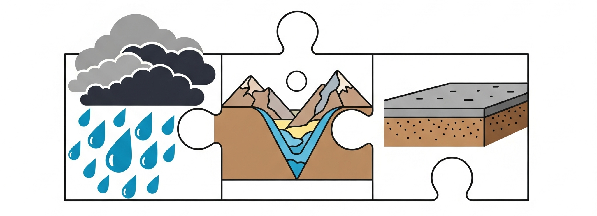

# Die Ahrtal-Katastrophe 2021 - Wiederholung

## Was führte zur schlimmsten Überschwemmung der letzten Jahre?

Am 14. und 15. Juli 2021 erlebte das Ahrtal in Rheinland-Pfalz eine der schlimmsten Naturkatastrophen in der deutschen Geschichte. Über 130 Menschen verloren ihr Leben, tausende Häuser wurden zerstört und ganze Dörfer standen unter Wasser. Doch wie konnte es zu einer so verheerenden Überschwemmung kommen?

Die Antwort liegt nicht in einem einzelnen Faktor, sondern im **Zusammenwirken von drei verschiedenen Ursachen**. Wie bei einem Puzzle mussten alle Teile zusammenpassen, damit die Katastrophe entstehen konnte.

**Der erste Faktor** war ein extremes Wetterereignis: **Starkregen**. In wenigen Stunden fielen mehr als 100 Liter Regen pro Quadratmeter - das ist etwa so viel, wie normalerweise in zwei Monaten regnet! Solche Extremwetterereignisse werden durch den Klimawandel immer häufiger, weil wärmere Luft mehr Wasserdampf aufnehmen kann.

**Der zweite Faktor** war die besondere Geländeform des Ahrtals: Es ist ein **Kerbtal** mit sehr steilen Hängen und einem schmalen Talboden. Die Berghänge wirkten wie ein riesiger Trichter, der das Regenwasser von allen Seiten ins enge Tal leitete. In einem breiten, flachen Tal hätte sich das Wasser verteilen können - im schmalen Ahrtal sammelte es sich und stieg schnell an.

**Der dritte Faktor** war die hohe **Flächenversiegelung** im Ahrtal. Viele Flächen sind mit Häusern, Straßen und Parkplätzen bebaut - das sind versiegelte Flächen, auf denen Regenwasser nicht versickern kann. Das Ahrtal hat sogar 38% mehr versiegelte Fläche pro Einwohner als der deutsche Durchschnitt! Das Wasser konnte also nicht im Boden versickern, sondern floss sofort oberflächlich ab und verstärkte die Überschwemmung.

Nur weil alle drei Faktoren zusammenkamen - Starkregen, Kerbtal und hohe Versiegelung - entstand diese verheerende Katastrophe. Verstehe man diese Zusammenhänge, kann man auch andere gefährdete Gebiete erkennen und sich besser schützen.

---

## Lage des Ahrtals

<iframe 
  width="600" 
  height="400" 
  frameborder="0" 
  scrolling="no" 
  marginheight="0" 
  marginwidth="0" 
  src="https://www.openstreetmap.org/export/embed.html?bbox=6.7,50.4,7.2,50.6&layer=mapnik&marker=50.5,6.95" 
  style="border: 1px solid black">
</iframe>

Übung: WO liegt das Ahrtal? Auf der Karte unterhalb findest du mehrere blaue Marker. Suche sie und klicke bei jedem an, ob dort das Ahrtal liegt, oder nicht. Überprüfe dann deine Antwort. 

<iframe src="https://learningapps.org/watch?v=pbsnuofqj25" style="border:0px;width:100%;height:500px" allowfullscreen="true" webkitallowfullscreen="true" mozallowfullscreen="true"></iframe>

---

## Aufgaben zur Wiederholung

### Aufgabe 1 [MC]

Welche drei Hauptfaktoren führten zur Ahrtal-Katastrophe? Wähle die richtigen Antworten aus:

- Erdbeben
- Starkregen durch Klimawandel (richtige Option)
- Vulkanausbruch
- Kerbtal mit steilen Hängen (richtige Option)
- Hohe Flächenversiegelung (richtige Option)
- Tsunami
- Dürre

---

### Aufgabe 2 [SC]

Was versteht man unter "Starkregen"?

- Regen, der sehr kalt ist
- Sehr viel Regen in kurzer Zeit (über 100 Liter pro Quadratmeter) (richtig)
- Regen, der nur im Winter fällt
- Regen, der sehr lange dauert

---

### Aufgabe 3 [LÜCKE]

Vervollständige den Satz: Ein Kerbtal wirkt bei Starkregen wie ein [Trichter], weil das Wasser von den [steilen] Hängen schnell ins [schmale] Tal fließt.

Lücken: Trichter, steilen, schmale

---

### Aufgabe 4 [SC]

Was passiert mit Regenwasser auf versiegelten Flächen?

- Es versickert langsam im Boden
- Es verdunstet sofort
- Es fließt schnell oberflächlich ab (richtig)
- Es wird von Pflanzen aufgenommen

---

### Aufgabe 5 [SC]

Was ist das Problem mit der Flächenversiegelung im Ahrtal?

- Es gibt zu wenig versiegelte Flächen
- Es gibt überdurchschnittlich viele versiegelte Flächen (richtig)
- Die versiegelten Flächen sind zu klein
- Die Versiegelung ist zu alt

---

### Aufgabe 6 [ORDER]

Bringe die Ereignisse in die richtige Reihenfolge:

1. Starkregen fällt vom Himmel
2. Das Wasser sammelt sich im schmalen Kerbtal
3. Versiegelte Flächen verstärken den Abfluss
4. Überschwemmung im Ahrtal

---

### Aufgabe 7 [SC]

Warum gibt es durch den Klimawandel mehr Starkregen? Wähle die richtige Erklärung:

- Weil es insgesamt mehr regnet
- Weil wärmere Luft mehr Wasserdampf aufnehmen kann (7% pro Grad wärmer) (richtig)
- Weil die Sonne stärker scheint
- Weil es mehr Wolken gibt

---

### Aufgabe 8 [MC]

Welche anderen Gebiete in Deutschland könnten ähnlich gefährdet sein? Wähle alle zutreffenden aus:

- Täler im Schwarzwald (richtige Option)
- Alpentäler in Bayern (richtige Option)
- Norddeutsche Tiefebene
- Täler im Harz (richtige Option)
- Ostfriesische Inseln

---

### Aufgabe 9 [OFFEN]

Erkläre in 2-3 Sätzen, warum die Ahrtal-Katastrophe so schlimm war:

Antwort: Ein extremer Starkregen traf auf ein Kerbtal mit steilen Hängen, wodurch sich das Wasser wie in einem Trichter sammelte. Die vielen versiegelten Flächen verstärkten das Problem, weil das Wasser nicht versickern konnte und schnell abfloss. Alle drei Faktoren zusammen führten zu der verheerenden Überschwemmung.

---

### Aufgabe 10 [MC]

Bewerte die folgenden Aussagen (wähle alle FALSCHEN Aussagen):

- Die Ahrtal-Katastrophe hatte nur eine einzige Ursache. (richtige Option)
- Versiegelte Flächen können Regenwasser genauso gut aufnehmen wie Wiesen. (richtige Option)
- Kerbtäler sind bei Starkregen besonders gefährlich.
- Der Klimawandel macht Starkregen-Ereignisse wahrscheinlicher.

---

## Der Wasserkreislauf und die Ahrtal-Katastrophe

Erinnerst du dich an den **Wasserkreislauf**? Normalerweise funktioniert er so: Die Sonne lässt Wasser aus Meeren und Flüssen verdunsten. Der Wasserdampf steigt auf, bildet Wolken und regnet wieder ab. Das Regenwasser versickert im Boden oder fließt langsam zurück in die Flüsse. So bleibt alles im Gleichgewicht.

*Du willst nochmal das Arbeitsblatt zum Wasserkreislauf üben? [➡️ Hier geht's lang...](Wasserkreislauf)

**Aber im Ahrtal 2021 wurde dieser natürliche Kreislauf gestört:**

- **Beim Starkregen** regnete viel mehr Wasser ab, als normalerweise. Der Klimawandel sorgt dafür, dass die warme Luft mehr Wasserdampf aufnehmen kann - und wenn sich die Wolken entleeren, regnet es extremer.
- **Im Kerbtal** konnte sich das Regenwasser nicht normal verteilen. Statt langsam abzufließen, sammelte es sich schnell an einer Stelle.
- **Auf versiegelten Flächen** konnte das Wasser nicht versickern, wie es im natürlichen Wasserkreislauf vorgesehen ist. Stattdessen floss es sofort oberflächlich ab.

So wurde aus dem normalerweise harmlosen Wasserkreislauf eine gefährliche Situation: **Zu viel Wasser kam zu schnell an einem Ort zusammen.**

### Aufgabe 11 [MC]

Was gehört zum normalen Wasserkreislauf? Wähle alle richtigen Antworten:

- Verdunstung durch die Sonne (richtige Option)
- Wolkenbildung in der Luft (richtige Option)
- Regen fällt langsam und gleichmäßig (richtige Option)
- Wasser versickert im Boden (richtige Option)
- Wasser sammelt sich schnell in Tälern
- Alles Wasser fließt sofort oberflächlich ab

---

### Aufgabe 12 [OFFEN]

Erkläre in einem Satz, wie die drei Faktoren der Ahrtal-Katastrophe den natürlichen Wasserkreislauf gestört haben:

Antwort: Der Klimawandel sorgte für extremen Starkregen, das Kerbtal sammelte das Wasser wie ein Trichter, und die versiegelten Flächen verhinderten das normale Versickern im Boden.

---

[Codewort: Biber]

## Zusammenfassung: Die drei Puzzleteile der Katastrophe

🌧️ **Starkregen** (Klimawandel) + 🏔️ **Kerbtal** (Trichterwirkung) + 🏗️ **Versiegelung** (kein Versickern) = 🌊 **Überschwemmung**

Nur wenn alle drei Faktoren zusammenkommen, entsteht ein so hohes Risiko für Überschwemmungen. Das erklärt, warum manche Gebiete besonders gefährdet sind und andere nicht.