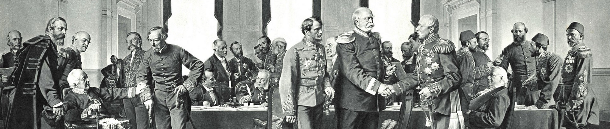

# Wie kam es zur Gründung des deutschen Reichs

{button: (Starte hier)(035_Kartenvergleich)}

---

### Alle Inhalte

- [❌ 01_Wdh_Rev48](01_Wdh_Rev48.md)
- [❌ 02_Antworten_Forderungen_Revolution](02_Antworten_Forderungen_Revolution.md)
- [❌ 03_Karikatur_Friedrich](03_Karikatur_Friedrich.md)
- [✅ 035_Kartenvergleich](035_Kartenvergleich.md)
- [✅04_Vermutungen](04_Vermutungen.md)
- [✅ 05_Zitat_Bismarck](05_Zitat_Bismarck.md)
- [✅ 06_Einigungskriege](06_Einigungskriege.md)

### Ergänzendes Material

_Die [Wilde Jagd](https://de.wikipedia.org/wiki/Wilde_Jagd "Wilde Jagd") 1870_: Der preußische Ministerpräsident Bismarck hält auf einem Schlachtfeld des [Deutsch-Französischen Krieges](https://de.wikipedia.org/wiki/Deutsch-Franz%C3%B6sischer_Krieg "Deutsch-Französischer Krieg") eine Flagge mit der Aufschrift „Blut u Eisen / Gewalt vor Recht.“ Er wird links und rechts von Gerippen begleitet, die den [Tod](https://de.wikipedia.org/wiki/Todessymbolik "Todessymbolik") symbolisieren. Ihnen folgt in einem [Triumphwagen](https://de.wikipedia.org/wiki/Triumphwagen "Triumphwagen") der preußische König Wilhelm I. Der Monarch zeigt sich einer teils verzweifelten und teils begeisterten Menschenmenge am Seitenrand als siegreicher [Triumphator](https://de.wikipedia.org/wiki/R%C3%B6mischer_Triumph "Römischer Triumph"). Das in der Flagge auftauchende „Blut u[nd] Eisen“ – in einer Ansprache Bismarcks am 30. September 1862 gefallene Worte – wird in Zusammenhang mit einer weiteren Rede des Ministerpräsidenten gebracht. Die Ansprache hielt Bismarck am 27. Januar 1863, wobei ihm die Worte „Macht geht vor Recht“ zugeschrieben wurden. In der Fahne erfährt die Phrase eine Umänderung in die Wendung „Gewalt vor Recht.“ Bismarck bestritt jedoch die Urheberschaft der Phrase „Macht geht vor Recht“. Karikatur von [Karel Klíč](https://de.wikipedia.org/wiki/Karel_Kl%C3%AD%C4%8D "Karel Klíč") aus der österreichischen Satirezeitung [_Der Floh_](https://de.wikipedia.org/wiki/Der_Floh_\(1869%E2%80%931919\) "Der Floh (1869–1919)") vom 25. Dezember 1870.[1](1)(https://de.wikipedia.org/wiki/Blut_und_Eisen#cite_note-1)

