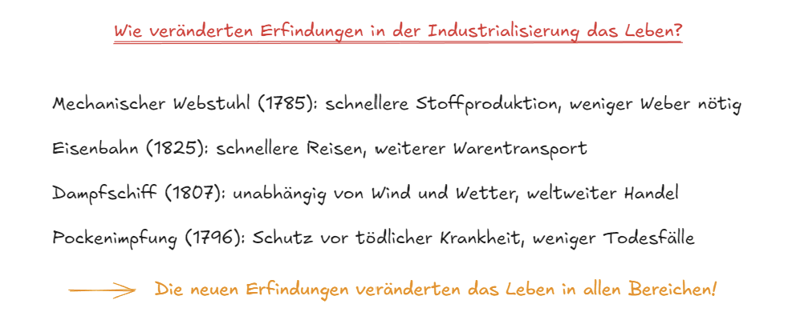

# Wiederholung: Erfindungen der Industrialisierung

## Das Wichtigste in Kürze

Nach der Erfindung der Dampfmaschine folgten viele weitere **wichtige Erfindungen**. Diese veränderten das Leben der Menschen in allen Bereichen.

**Der mechanische Webstuhl (1785)**: Edmund Cartwright erfand den mechanischen Webstuhl, der von einer Dampfmaschine angetrieben wurde. Vorher webten die Menschen Stoffe von Hand – das dauerte sehr lange. Der mechanische Webstuhl konnte viel **schneller** viel **mehr Stoff** herstellen. Aber es wurden **weniger Weber** gebraucht als vorher.

**Die Eisenbahn (1825)**: George Stephenson baute die erste Dampflokomotive. Vorher reisten die Menschen mit Pferdekutschen – das war sehr langsam. Eine Reise von 100 Kilometern dauerte mehrere Tage. Mit der Eisenbahn konnte man viel **schneller und weiter reisen**. Man konnte auch viel **mehr Waren transportieren**.

**Das Dampfschiff (1807)**: Robert Fulton baute das erste erfolgreiche Dampfschiff, die "Clermont". Vorher fuhren Schiffe mit Segeln und waren vom Wind abhängig. Ohne Wind mussten die Schiffe sogar von Menschen oder Pferden gezogen werden. Das Dampfschiff war **unabhängig vom Wind und Wetter** und konnte auch gegen den Wind fahren. So wurde der **weltweite Handel** möglich.

**Die Pockenimpfung (1796)**: Edward Jenner entwickelte die erste Impfung gegen die Pocken. Die Pocken waren eine gefährliche Krankheit, an der viele Menschen starben, besonders Kinder. Jenner stellte fest, dass Menschen, die an Kuhpocken erkrankt waren, nicht an den gefährlichen Pocken erkrankten. Mit der Impfung konnten sich Menschen **schützen** und **weniger Menschen starben**.

>**Fazit:** Die neuen Erfindungen veränderten das Leben in allen Bereichen! Sie machten vieles schneller, einfacher und sicherer – aber nicht für alle Menschen waren die Veränderungen positiv.

---

### Aufgabe 1 [MC]

Was änderte sich durch den mechanischen Webstuhl? (Mehrere Antworten sind richtig!)

- Es konnte schneller produziert werden (richtige Option)
- Es konnte mehr Stoff hergestellt werden (richtige Option)
- Es wurden weniger Weber gebraucht (richtige Option)
- Die Arbeit wurde von Hand gemacht

---

### Aufgabe 2 [LÜCKE]

Vervollständige den Text:

Die Eisenbahn wurde von [George Stephenson] erfunden. Sie fuhr auf [Schienen] und wurde von einer [Dampfmaschine] angetrieben. Sie konnte viel [schneller] fahren als Pferdekutschen.

Lücken: George Stephenson, Schienen, Dampfmaschine, schneller

---

### Aufgabe 3 [SC]

In welchem Jahr wurde die erste Eisenbahn gebaut?

- 1785
- 1796
- 1807
- 1825 (richtig)

---

### Aufgabe 4 [MC]

Was waren Vorteile der Eisenbahn? (Mehrere Antworten sind richtig!)

- Schnellere Reisen (richtige Option)
- Weiterer Warentransport (richtige Option)
- Man konnte mehr Waren transportieren (richtige Option)
- Sie war abhängig vom Wetter

---

### Aufgabe 5 [SC]

Wovon waren Segelschiffe abhängig?

- Von Kohle
- Von Wind (richtig)
- Von Dampf
- Von Elektrizität

---

### Aufgabe 6 [ORDER]

Bringe die Erfindungen in die richtige zeitliche Reihenfolge:

1. Mechanischer Webstuhl
2. Pockenimpfung
3. Dampfschiff
4. Eisenbahn

---

### Aufgabe 7 [LÜCKE]

Vervollständige den Text über die Pockenimpfung:

Edward Jenner stellte fest, dass Menschen, die an [Kuhpocken] erkrankt waren, nicht an den gefährlichen [Pocken] erkrankten. Mit der [Impfung] konnten sich Menschen schützen und [weniger] Menschen starben.

Lücken: Kuhpocken, Pocken, Impfung, weniger

---

### Aufgabe 8 [MC]

Welche Erfindungen basierten auf der Dampfmaschine? (Mehrere Antworten sind richtig!)

- Mechanischer Webstuhl (richtige Option)
- Eisenbahn (richtige Option)
- Dampfschiff (richtige Option)
- Pockenimpfung

---

### Aufgabe 9 [SC]

Welche Aussage über die Erfindungen der Industrialisierung ist richtig?

- Sie veränderten nur die Arbeit in Fabriken
- Sie machten das Leben für alle Menschen gleich gut
- Sie veränderten das Leben in allen Bereichen (richtig)
- Sie hatten keine negativen Folgen

---

{button: (Zurück zur Wiederholung zur Industrialisierung)(wiederholung-home)}