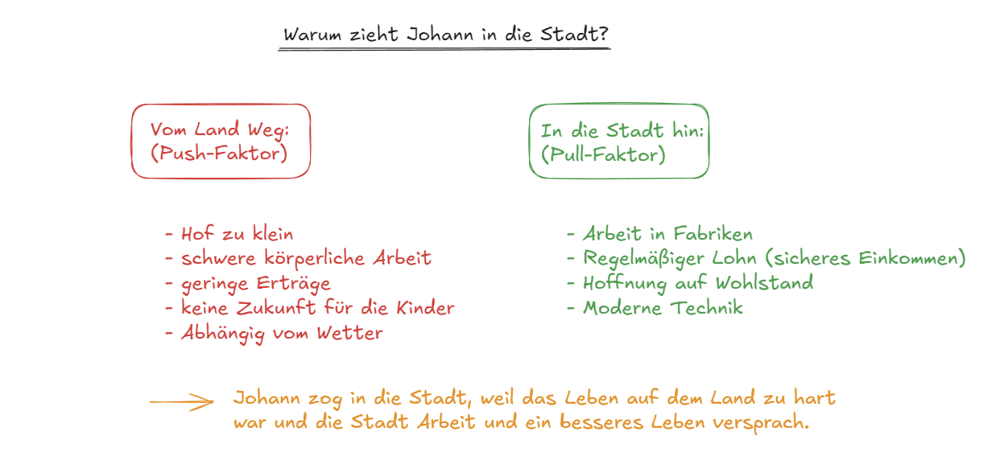

# Wiederholung: Warum zogen Menschen in die Stadt?

## Das Wichtigste in Kürze

Während der Industrialisierung verließen viele Menschen das Land und zogen in die Städte. Diesen Vorgang nennt man **Landflucht** oder **Urbanisierung**. Die Städte wuchsen sehr schnell. Schweinfurt hatte 1800 etwa 6.000 Einwohner, 1880 waren es schon über 16.000 – fast dreimal so viele!

Aber warum verließen so viele Menschen ihre Höfe? Dafür gab es verschiedene Gründe.

**Push-Faktoren** sind Gründe, die die Menschen **vom Land wegtrieben**:

- Der **Hof war zu klein**: Wenn ein Bauer starb, musste der Hof oft unter den Kindern aufgeteilt werden. Jeder bekam nur einen kleinen Teil. Dieser kleine Hof reichte kaum noch zum Leben.
- **Schwere körperliche Arbeit**: Die Bauern mussten von morgens bis abends hart arbeiten. Die Arbeit mit Sense und Pflug war sehr anstrengend.
- **Geringe Erträge**: Was die Bauern ernteten, reichte oft nur knapp zum Leben. Bei schlechter Ernte gab es sogar Hunger.
- **Abhängig vom Wetter**: Wenn es zu viel oder zu wenig regnete, wurde die Ernte schlecht. Die Bauern konnten nichts dagegen tun.
- **Keine Zukunft für die Kinder**: Die Höfe waren zu klein für alle Kinder. Es gab keine Perspektive für die nächste Generation.

**Pull-Faktoren** sind Gründe, die die Menschen **zur Stadt hinzogen**:

- **Arbeit in Fabriken**: In den Städten entstanden viele neue Fabriken, die Arbeiter suchten.
- **Regelmäßiger Lohn**: In der Fabrik bekam man jeden Monat Lohn – egal ob es regnete oder die Sonne schien. Das war ein **sicheres Einkommen**.
- **Hoffnung auf Wohlstand**: Die Menschen hofften, dass sie in der Stadt ein besseres Leben haben würden als auf dem Land.
- **Moderne Technik**: Die Stadt wirkte modern mit Dampfschiffen, Fabriken und manchmal sogar elektrischem Licht.

**Fazit:** Johann zog in die Stadt, weil das Leben auf dem Land zu hart war und die Stadt Arbeit und ein besseres Leben versprach.

---

## Quiz: Teste dein Wissen!

### Aufgabe 1 [SC]

Wie nennt man den Vorgang, dass viele Menschen vom Land in die Stadt ziehen?

- Industrialisierung
- Landflucht (richtig)
- Fabrikation
- Migration

---

### Aufgabe 2 [SC]

Warum wurden die Bauernhöfe immer kleiner?

- Weil die Bauern weniger Land kauften
- Weil der Hof unter den Kindern aufgeteilt wurde (richtig)
- Weil der Staat Land beschlagnahmte
- Weil Fabriken Land kauften

---

### Aufgabe 3 [LÜCKE]

Vervollständige die Zuordnung der Faktoren:

**Push-Faktoren** (vom Land weg) waren: [Hof zu klein], [schwere körperliche Arbeit], [geringe Erträge], [abhängig vom Wetter] und [keine Zukunft für Kinder].
**Pull-Faktoren** (zur Stadt hin) waren: [Arbeit in Fabriken], [regelmäßiger Lohn], [Hoffnung auf Wohlstand] und [moderne Technik].

Lücken: Hof zu klein, schwere körperliche Arbeit, geringe Erträge, abhängig vom Wetter, keine Zukunft für Kinder, Arbeit in Fabriken, regelmäßiger Lohn, Hoffnung auf Wohlstand, moderne Technik

---

### Aufgabe 4 [LÜCKE]

Vervollständige den Text:

Viele Bauern waren [abhängig] vom Wetter. Bei schlechter Ernte gab es [Hunger]. In den Städten gab es [Arbeit] in Fabriken. Dort bekam man jeden Monat [Lohn].

Lücken: abhängig, Hunger, Arbeit, Lohn

---

### Aufgabe 5 [SC]

Wie veränderte sich die Einwohnerzahl von Schweinfurt?

- Sie blieb gleich
- Sie verdoppelte sich
- Sie verdreifachte sich fast (richtig)
- Sie halbierte sich

---

### Aufgabe 6 [ORDER]

Bringe Johanns Überlegungen in die richtige Reihenfolge:

1. Der Hof wird unter drei Brüdern aufgeteilt
2. Der Hof ist zu klein zum Leben
3. Johann hört von Fabriken in der Stadt
4. Johann entscheidet sich, in die Stadt zu ziehen

---

### Aufgabe 7 [SC]

Was war für die Menschen auf dem Land besonders an der Fabrikarbeit?

- Sie war leichter als Feldarbeit
- Man bekam regelmäßig Lohn – unabhängig vom Wetter (richtig)
- Man musste weniger arbeiten
- Man konnte früher in Rente gehen

---

### Aufgabe 8 [OFFEN]

Erkläre: Warum zog Johann in die Stadt?

Antwort: Johann zog in die Stadt, weil das Leben auf dem Land zu hart war. Der Hof war zu klein, die Arbeit war schwer, und die Erträge reichten kaum zum Leben. In der Stadt gab es Arbeit in Fabriken mit regelmäßigem Lohn. Johann hoffte auf ein besseres Leben für sich und seine Kinder.

---

{button: (Zurück zur Wiederholung zur Industrialisierung)(wiederholung-home)}

