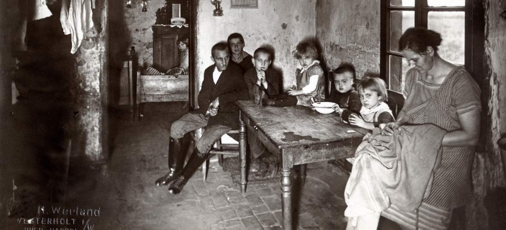
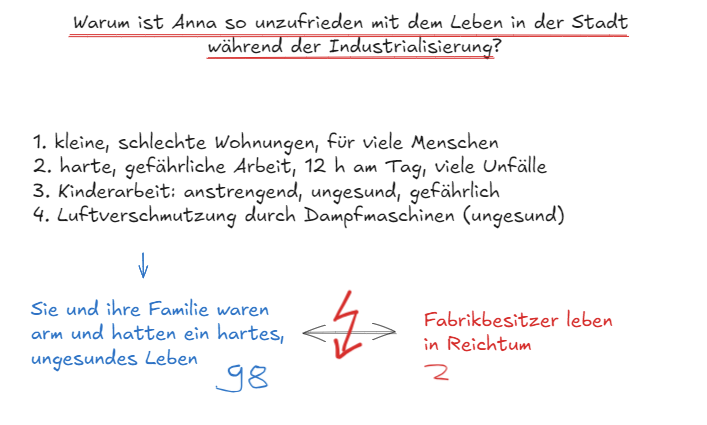

# Wiederholung: Wie war das Leben in der Stadt?

## Das Wichtigste in Kürze

Johann war mit seiner Familie in die Stadt gezogen. Er hatte gehofft, dort ein besseres Leben zu finden. Aber seine Frau **Anna** war sehr **unzufrieden** mit dem Leben in der Stadt. Warum?

**1. Kleine, schlechte Wohnungen** Die Wohnungen waren sehr klein. Oft schlief die ganze Familie in einem einzigen Zimmer. Die Wohnungen waren schlecht gebaut und oft kaputt.

**2. Harte, gefährliche Arbeit** Die Arbeit in der Fabrik war sehr hart. Die Arbeiter mussten **12 Stunden am Tag** arbeiten. Es gab **keine Schutzkleidung** und oft gab es **Unfälle**. Die Arbeit war gefährlich und anstrengend.

**3. Kinderarbeit** Auch **Kinder mussten arbeiten**, schon als sie sehr jung waren. Die Arbeit war gefährlich und ungesund für sie. Manche Kinder arbeiteten sogar im Bergwerk.

**4. Luftverschmutzung** Die Dampfmaschinen in den Fabriken und Lokomotiven erzeugten viel Rauch und Ruß. Die Luft in den Städten war schmutzig und **ungesund**.

**Zwei verschiedene Welten:** Zur Zeit der Industrialisierung gab es zwei neue **Klassen**:

- Die **Arbeiterklasse**: Menschen wie Anna, die schwer arbeiten mussten, wenig Geld bekamen und arm waren. Das waren **98 von 100 Menschen**.
- Die **Fabrikbesitzer**: Reiche Menschen, die die Fabriken besaßen und von der Arbeit der Arbeiter profitierten. Das waren nur **2 von 100 Menschen**.

---

## Quiz: Teste dein Wissen!

### Aufgabe 1 [SC]

Warum war Anna unzufrieden mit dem Leben in der Stadt?

- Weil sie ihren Hof vermisste
- Weil das Leben hart und ungesund war (richtig)
- Weil sie keine Arbeit fand
- Weil sie sich mit Johann gestritten hat

---

### Aufgabe 2 [MC]

Was waren Probleme des Lebens in der Stadt für Arbeiterfamilien? (Mehrere Antworten sind richtig!)

- Kleine, schlechte Wohnungen (richtige Option)
- Harte, gefährliche Arbeit (richtige Option)
- Kinderarbeit (richtige Option)
- Zu viel Freizeit

---

### Aufgabe 3 [SC]

Wie lange mussten die Arbeiter in den Fabriken arbeiten?

- 6 Stunden am Tag
- 8 Stunden am Tag
- 12 Stunden am Tag (richtig)
- 16 Stunden am Tag

---

### Aufgabe 4 [LÜCKE]

Vervollständige den Text:

Die ganze Familie lebte oft in einem einzigen [Zimmer]. Die Arbeit war [gefährlich], weil es keine [Schutzkleidung] gab. Auch [Kinder] mussten arbeiten. Die [Luftverschmutzung] durch Dampfmaschinen war ungesund.

Lücken: Zimmer, gefährlich, Schutzkleidung, Kinder, Luftverschmutzung

---

### Aufgabe 5 [SC]

Wie viele Menschen von 100 lebten wie Anna in Armut?

- 20 von 100
- 50 von 100
- 80 von 100
- 98 von 100 (richtig)

---

### Aufgabe 6 [SC]

Wer waren die Fabrikbesitzer?

- Menschen, die in Fabriken arbeiteten
- Reiche Menschen, die Fabriken besaßen und von der Arbeit anderer profitierten (richtig)
- Menschen, die Fabriken bauten
- Menschen, die Dampfmaschinen erfanden

---

### Aufgabe 7 [MC]

Was machten die Arbeiter, um ihre Situation zu verbessern? (Mehrere Antworten sind richtig!)

- Sie schlossen sich zusammen (richtige Option)
- Sie organisierten Streiks (richtige Option)
- Sie demonstrierten (richtige Option)
- Sie akzeptierten alles still

---

{button: (Zurück zur Wiederholung zur Industrialisierung)(wiederholung-home)}